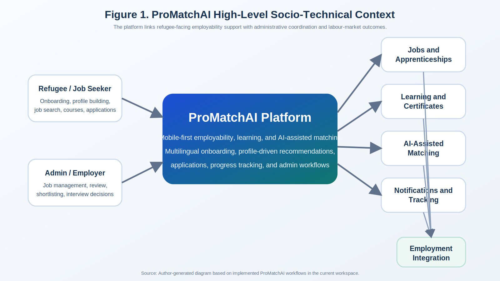
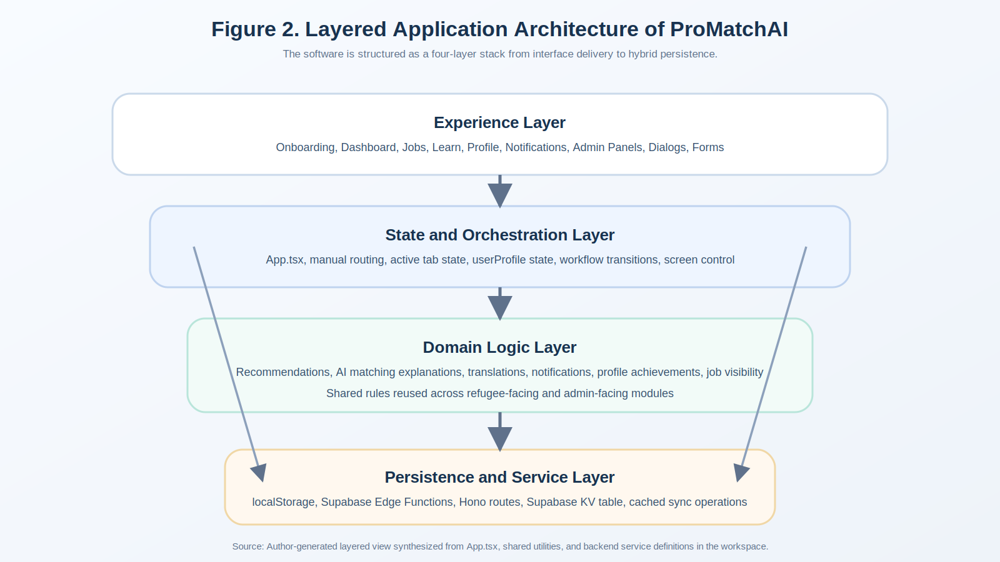
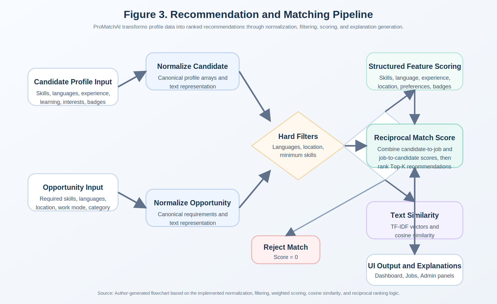
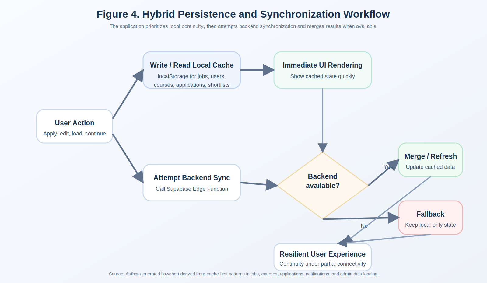
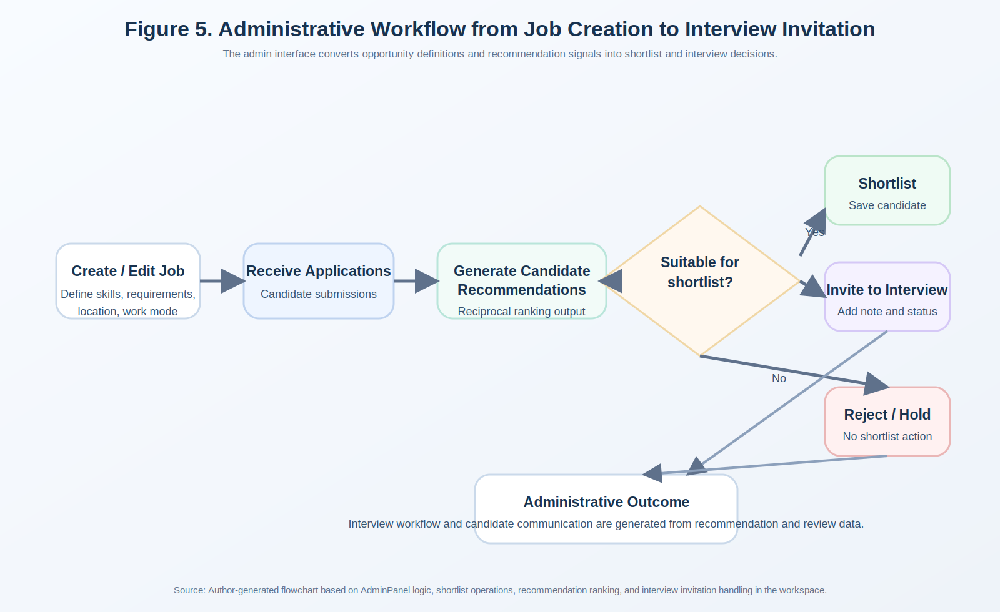
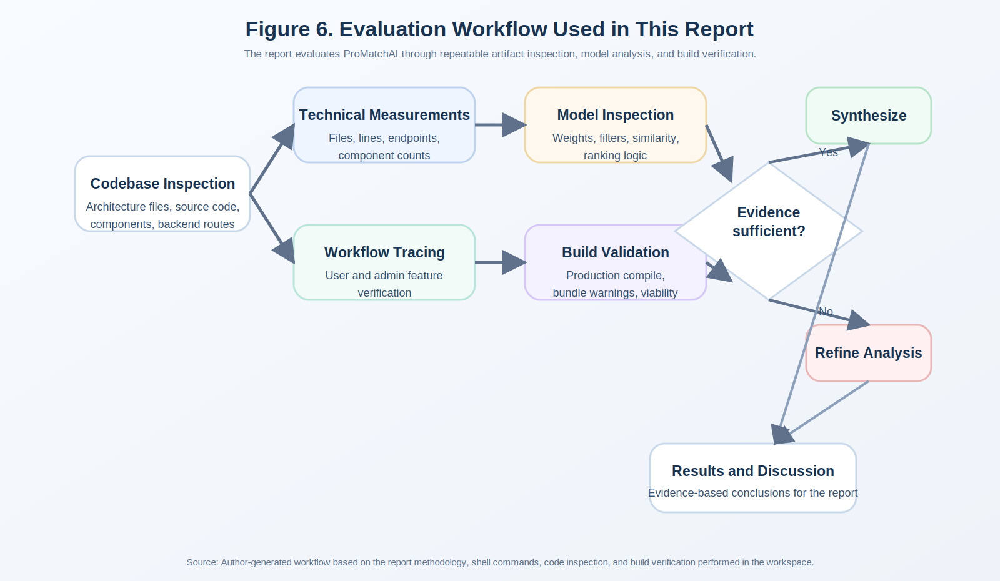

# ProMatchAI
## A Mobile-First Refugee Employment, Learning, and AI-Assisted Matching Platform

### Academic Project Report

---

## Table of Contents

1. [List of Figures and Tables](#list-of-figures-and-tables)
2. [Chapter 1: Introduction](#chapter-1-introduction)
   1. [Background and Context of the Project](#11-background-and-context-of-the-project)
   2. [Problem Statement](#12-problem-statement)
   3. [Objectives and Aims](#13-objectives-and-aims)
   4. [Scope and Limitations](#14-scope-and-limitations)
   5. [Significance of the Study](#15-significance-of-the-study)
   6. [Structure of the Report](#16-structure-of-the-report)
3. [Chapter 2: Literature Review](#chapter-2-literature-review)
   1. [Digital Labour-Market Integration for Refugees](#21-digital-labour-market-integration-for-refugees)
   2. [Job Recommender Systems and Skill Matching](#22-job-recommender-systems-and-skill-matching)
   3. [Explainable, Fair, and Human-Centred AI](#23-explainable-fair-and-human-centred-ai)
   4. [Mobile-First and Offline-First Service Design](#24-mobile-first-and-offline-first-service-design)
   5. [Comparative Analysis of Similar Systems](#25-comparative-analysis-of-similar-systems)
   6. [Research Gaps](#26-research-gaps)
   7. [Critical Synthesis](#27-critical-synthesis)
4. [Chapter 3: Methodology](#chapter-3-methodology)
   1. [Research Design and Approach](#31-research-design-and-approach)
   2. [Requirements Derivation and Design Principles](#32-requirements-derivation-and-design-principles)
   3. [System Architecture and Design](#33-system-architecture-and-design)
   4. [Data Collection Methods](#34-data-collection-methods)
   5. [Tools and Technologies Used](#35-tools-and-technologies-used)
   6. [Algorithms, Models, and Frameworks Applied](#36-algorithms-models-and-frameworks-applied)
   7. [Mathematical Formulation of the AI Recommendation System](#361-mathematical-formulation-of-the-ai-recommendation-system)
   8. [Implementation Process](#37-implementation-process)
   9. [Ethical and Validity Considerations](#38-ethical-and-validity-considerations)
5. [Chapter 4: Empirical Study / Results](#chapter-4-empirical-study--results)
   1. [Evaluation Design](#41-evaluation-design)
   2. [Artifact Profile of the Implemented System](#42-artifact-profile-of-the-implemented-system)
   3. [Functional Results](#43-functional-results)
   4. [Recommendation and Matching Results](#44-recommendation-and-matching-results)
   5. [Build and Deployment Results](#45-build-and-deployment-results)
   6. [Results Summary](#46-results-summary)
6. [Chapter 5: Discussion](#chapter-5-discussion)
   1. [In-Depth Analysis of Results](#51-in-depth-analysis-of-results)
   2. [Comparison with Existing Systems](#52-comparison-with-existing-systems)
   3. [Strengths and Weaknesses of the Proposed System](#53-strengths-and-weaknesses-of-the-proposed-system)
   4. [Practical Implications](#54-practical-implications)
7. [Chapter 6: Conclusion](#chapter-6-conclusion)
   1. [Summary of Findings](#61-summary-of-findings)
   2. [Key Contributions](#62-key-contributions)
   3. [Limitations of the Study](#63-limitations-of-the-study)
   4. [Recommendations and Future Work](#64-recommendations-and-future-work)
8. [References](#references)
9. [Appendix](#appendix)

---

## List of Figures and Tables

### Figures

- **Figure 1.** ProMatchAI high-level socio-technical context.
- **Figure 2.** Layered application architecture of ProMatchAI.
- **Figure 3.** Recommendation and matching pipeline.
- **Figure 4.** Hybrid persistence and synchronization workflow.
- **Figure 5.** Administrative workflow from job creation to interview invitation.
- **Figure 6.** Evaluation workflow used in this project report.

### Tables

- **Table 1.** Core project objectives and their operational interpretation.
- **Table 2.** Comparative review of related systems and approaches.
- **Table 3.** Research gaps identified from the literature.
- **Table 4.** Principal implementation technologies in ProMatchAI.
- **Table 5.** Recommendation feature set and weighting logic.
- **Table 6.** Summary of system modules implemented in the codebase.
- **Table 7.** Empirical artifact metrics collected from the workspace.
- **Table 8.** Functional evaluation matrix for the implemented prototype.
- **Table 9.** Representative recommendation scenarios and computed outcomes.
- **Table 10.** Strengths, weaknesses, and implications of the proposed system.

---

## Chapter 1: Introduction

### 1.1 Background and Context of the Project

The last decade has seen a major increase in attention to the problem of refugee inclusion within host-country labour markets. Across Europe and other receiving regions, public institutions, non-governmental organizations, employers, and technology providers have increasingly recognized that employment is not merely an economic outcome, but also a core mechanism of long-term social integration, dignity, self-reliance, and community participation. Ager and Strang’s influential integration framework places employment among the central “markers and means” of integration, alongside housing, education, and health. More recent studies continue to show that labour-market participation is both a practical survival issue and a social recognition issue for displaced populations. Yet refugee access to work remains constrained by language barriers, incomplete credential recognition, disrupted education histories, digital exclusion, fragmented support systems, low-trust recruitment processes, and a lack of coordinated pathways from skills acquisition into actual employment opportunities.

These structural barriers have created an important design space for digital platforms that do more than simply list vacancies. A refugee-oriented employability platform must cope with incomplete profiles, varying literacy and language needs, differences in prior work documentation, frequent device constraints, and the need to combine job discovery with upskilling, administrative mediation, and trust-building. Conventional recruitment platforms are usually designed for users who already possess relatively stable work histories, polished CVs, strong digital literacy, and seamless access to desktop infrastructure. That assumption does not hold for many displaced users, especially those who are newly arrived, economically vulnerable, or navigating precarious connectivity.

The project in this workspace, ProMatchAI, was designed against this backdrop. It is a mobile-first React application that combines several functions that are often separated in traditional systems: refugee onboarding, multilingual support, profile construction, job exploration, AI-style matching explanations, application tracking, learning and certification, employer or admin workflows, shortlisting, and notification support. The system is not a narrowly defined algorithmic experiment. Rather, it is a full-stack prototype of a socio-technical platform intended to bridge the gap between employability preparation and opportunity access. That design ambition is important because the needs of refugees are rarely served by single-function software. A job-matching engine without learning support is insufficient; a training platform without opportunity discovery creates a dead end; and an employer dashboard without interpretable candidate ranking does not reduce recruiter uncertainty.

From a computing perspective, ProMatchAI is also interesting because it represents a hybrid architecture that balances practical delivery with prototyping constraints. The front end is built with Vite and React, the backend uses Supabase Edge Functions with Hono on the Deno runtime, persistence is provided through a simple key-value table in Supabase, and the client relies heavily on `localStorage` to support offline-friendly behaviour and demo resilience. The platform includes a rule-based recommendation engine that combines skills, languages, experience, interests, badges, and lightweight text similarity to generate reciprocal candidate-opportunity scores. Although the application uses the language of “AI”, its implemented logic is primarily explainable ranking rather than a black-box machine learning model. This is an important architectural choice because explainability, maintainability, and low-resource deployability are especially valuable in welfare-oriented employment systems.

In practical terms, the codebase reveals that ProMatchAI has been shaped as an advanced capstone or thesis-level prototype. It contains more than one hundred tracked source artifacts under `src`, more than forty top-level React components, a refugee-facing multi-tab interface, and an admin panel that supports job management, course management, application review, shortlist handling, and recommendation-assisted candidate selection. The project also includes multilingual translation utilities, notification workflows, profile achievement computation, AI-style CV enhancement features, and mobile interface adaptations. The implemented system therefore provides a rich enough technical artifact to support a formal academic report that goes beyond superficial description.

At the same time, the project exists in a field where critical scrutiny matters. Digital matching systems can reproduce unfair assumptions, overstate the reliability of automated recommendations, or reduce complex human capability to simplistic skill labels. Refugee-serving systems raise additional ethical questions around transparency, data minimization, administrative trust, and the possibility of exclusion by design. For that reason, a rigorous project report must not only document what the system does, but also evaluate how its design aligns with current research on refugee labour integration, recommender systems, explainable AI, and inclusive mobile service design.

This report therefore approaches ProMatchAI as both a software engineering artifact and a socio-technical intervention. It investigates the project’s rationale, relates it to contemporary literature, documents the architecture and methodology used in implementation, and evaluates the prototype through empirical artifact analysis grounded in the actual codebase. The result is a thesis-style account of how a mobile-first, AI-assisted employability platform can be designed for a refugee context, what trade-offs that design introduces, and where the project advances or falls short of the current state of the art.

### 1.2 Problem Statement

The central problem addressed by this project is that existing employment pathways for refugees are often fragmented across disconnected services, while mainstream digital recruitment systems are poorly adapted to the lived realities of displaced job seekers. Refugees commonly need to navigate several separate processes: language selection, basic digital onboarding, profile creation, skills articulation, learning participation, job search, application submission, and communication with organizations or employers. In many real-world contexts, these processes are split across different institutions and platforms. The resulting fragmentation increases cognitive burden, weakens continuity, and creates multiple points of failure.

From a technical perspective, the problem can be decomposed into five interrelated dimensions.

First, there is a representation problem. Refugee users may have relevant experience, informal capabilities, multilingual competencies, and learning motivation, but conventional recruitment platforms tend to privilege highly standardized, document-rich profiles. This creates a mismatch between the applicant’s real capability and the platform’s representational logic.

Second, there is a matching problem. Even when profiles are created, users may struggle to identify appropriate jobs because the available opportunities are not ranked according to their current skills, languages, location constraints, training history, or work preferences. Employers, likewise, may lack tools to identify suitable applicants in a way that is transparent and operationally useful.

Third, there is a progression problem. Matching alone does not solve employability barriers. Many users need learning pathways, feedback on missing skills, and some form of motivational scaffolding. A system that merely says “no match” without suggesting how to improve does little to support integration.

Fourth, there is an accessibility and resilience problem. Refugee-serving systems must work under mobile-first conditions, intermittent connectivity, and low-trust environments. A technically elegant system that assumes constant broadband access, stable identity verification, and always-available backend services may fail in realistic use.

Fifth, there is a governance problem. Employment-related software increasingly incorporates AI or AI-like decision support, but if the recommendation process is opaque, users and administrators may not understand why certain opportunities or candidates are prioritized. In sensitive contexts, hidden logic can undermine trust and raise fairness concerns.

Accordingly, the specific problem addressed in this project can be stated as follows:

> There is a need for a mobile-first, multilingual, and practically explainable digital platform that integrates refugee onboarding, skill profiling, learning support, opportunity recommendation, application management, and admin-side candidate review in a single coherent workflow, while remaining lightweight enough to prototype and deploy under constrained conditions.

ProMatchAI is proposed as a response to this problem. The platform aims to provide a more integrated employability pathway by combining refugee-facing and admin-facing functionality with a rule-based recommendation engine and hybrid persistence model. This report evaluates whether the implemented system meaningfully addresses the problem and where important technical and methodological limitations remain.

### 1.3 Objectives and Aims

The overall aim of the project is to design and implement a practical prototype that improves refugee access to employment and learning opportunities through a mobile-first, AI-assisted digital platform. To make that aim academically tractable, it can be translated into a set of technical, functional, and evaluative objectives.

**Table 1. Core project objectives and their operational interpretation**

| Objective | Operational interpretation in ProMatchAI |
|---|---|
| Provide inclusive onboarding | Offer language-aware entry into refugee or employer/admin workflows |
| Support profile construction | Capture user skills, education, experience, preferences, and contact details |
| Recommend opportunities | Rank jobs using profile-opportunity similarity and basic hard filters |
| Enable learning progression | Present courses, track progress, and generate certificates |
| Assist administrators | Provide dashboards for managing jobs, courses, applications, and shortlists |
| Improve transparency | Display reasons, confidence labels, and matching explanations |
| Maintain resilience | Use cached client-side data and backend fallback for continuity |
| Demonstrate feasibility | Produce a deployable build and a coherent end-to-end architecture |

The detailed objectives of this report are therefore:

1. To analyze the societal and technical background that motivates refugee-focused employment platforms.
2. To critically review the literature on refugee labour-market integration, recommender systems, explainable AI, and mobile/offline system design.
3. To document the architecture, technologies, data flows, and implementation process used in ProMatchAI.
4. To identify the specific models, heuristics, and design decisions that underpin the platform’s matching and progression logic.
5. To evaluate the implemented artifact through codebase inspection, build validation, feature tracing, and scenario-based interpretation of the recommendation logic.
6. To assess the strengths, weaknesses, and practical implications of the system relative to existing approaches.
7. To provide academically grounded recommendations for future technical and research development.

These objectives position the project report as more than a user manual or design summary. The report aims to justify the project from a research standpoint, explain its engineering decisions, and situate its contribution within broader debates on inclusive digital employment systems.

### 1.4 Scope and Limitations

The scope of this project is defined by both what ProMatchAI implements and what it intentionally does not implement. The platform focuses on the employability journey of refugee or similarly displaced users who need a guided pathway from onboarding and skill articulation toward learning, job exploration, application submission, and administrative mediation. Within this scope, the system supports several major domains:

- multilingual onboarding and user-type selection;
- refugee login and sign-up style flows;
- skill profiling and profile completion;
- job browsing and application submission;
- learning course discovery, progress tracking, and certificates;
- profile editing, CV generation, and achievement tracking;
- notifications related to applications, courses, shortlists, and interviews;
- admin-side job, course, application, and shortlist management;
- recommendation-driven candidate and opportunity ranking.

The technical scope includes a React-based frontend, a Supabase Edge Function backend, a simple key-value persistence layer, and local offline-first caching. The project therefore lies at the intersection of frontend engineering, serverless backend design, human-centred systems, and explainable recommender logic.

However, the platform also has important limitations that define the boundary of the study.

First, ProMatchAI is a prototype rather than a production-grade deployment. The refugee authentication flow behaves more like local profile selection and demo persistence than a secure, standards-compliant identity system. This design choice is understandable in a capstone context but limits real-world deployment readiness.

Second, the implemented “AI” layer is predominantly rule-based rather than learned from large-scale behavioural data. The recommendation engine uses weighted features and simple text similarity, which improves interpretability but limits predictive sophistication. The project should therefore be understood as AI-assisted rather than as a fully machine-learned recommender platform.

Third, the evaluation conducted in this report is artifact-centred. The workspace does not include a formal user study, longitudinal deployment dataset, or controlled A/B experiment. As a result, the empirical chapter emphasizes technical functionality, architectural feasibility, and analytic interpretation rather than causal claims about labour-market outcomes.

Fourth, the persistence strategy relies on both client-side `localStorage` and backend storage, creating a dual-source-of-truth pattern that is useful for resilience but introduces synchronization complexity. This is a strength in prototyping terms and a weakness in enterprise data-governance terms.

Fifth, while the system is explicitly designed around refugee needs, the project does not implement advanced legal, policy, or credential-validation services. It does not resolve asylum status verification, regional work authorization, or formal qualification equivalence processes, all of which are highly consequential in actual refugee employment integration.

Finally, although the interface emphasizes multilingual experience, the academic report is limited to analysis of the English-language implementation artifacts in the workspace. The quality of translation content is outside the direct scope of this report, except where multilingual support affects system design.

### 1.5 Significance of the Study

The significance of this study lies in its contribution at three levels: social relevance, software engineering relevance, and academic research relevance.

At the social level, the project addresses a genuinely important challenge: improving refugee access to meaningful labour-market participation. Employment remains one of the strongest predictors of long-term integration, but access is constrained by barriers that are partly organizational and partly digital. A platform that can lower the friction between skill profiling, targeted learning, and opportunity discovery has clear practical value for refugees, NGOs, public services, and employers seeking more inclusive recruitment pathways.

At the software engineering level, ProMatchAI demonstrates how a relatively lightweight technology stack can be assembled into an end-to-end employability platform. The project integrates mobile-first interface design, serverless backend functions, hybrid persistence, explainable ranking, and role-specific workflows without relying on heavyweight enterprise infrastructure. This makes the system educationally valuable as a capstone artifact because it shows how multiple software engineering concerns can be coordinated into a single product.

At the research level, the study contributes to the intersection of digital inclusion and explainable recommendation. Much of the literature either focuses on refugee integration at the policy or social level without implementing concrete digital systems, or focuses on recommender systems without addressing the specific constraints of refugee employability. ProMatchAI occupies a meaningful middle ground: it is technically implemented, socially motivated, and evaluable through artifact-based analysis. That combination makes it a useful case study for how inclusive design principles can be translated into software structure.

The study is also significant because it resists the tendency to equate “AI” with opaque automation. By using rule-based and interpretable matching logic, the project offers an example of how AI-style assistance can be made operational without fully surrendering system behaviour to black-box models. This matters in socially sensitive application domains, where explainability, contestability, and user trust are not optional extras but core design requirements.

### 1.6 Structure of the Report

This report is organized into six chapters.

Chapter 1 introduces the background, problem, objectives, scope, and significance of the project. It frames ProMatchAI as a response to the challenges of refugee employability and inclusive digital platform design.

Chapter 2 reviews the literature relevant to the project. It covers refugee labour-market integration, recommender systems for jobs and skills, explainable and fair AI, mobile-first and offline-first architecture, and the design gaps that motivate ProMatchAI.

Chapter 3 explains the methodology used in the project. It discusses the research design, the architecture of the system, the data and implementation methods, the technologies used, the recommendation logic, and the ethical considerations associated with the prototype.

Chapter 4 presents the empirical study and results. Because the project is a prototype rather than a live field deployment, this chapter focuses on artifact-based evaluation, including codebase metrics, feature-level validation, build results, and scenario-based interpretation of the recommendation engine.

Chapter 5 discusses the meaning of the results. It compares the system with related platforms and research, identifies strengths and weaknesses, and draws out the practical implications of the design choices embedded in ProMatchAI.

Chapter 6 concludes the report by summarizing the findings, highlighting the key contributions, acknowledging the study’s limitations, and recommending future work.

The report then concludes with references and appendices containing supplementary diagrams, implementation tables, and representative excerpts from the architecture and workflow design.

---

## Chapter 2: Literature Review

### 2.1 Digital Labour-Market Integration for Refugees

Research on refugee integration consistently treats employment as a central mechanism through which social, economic, and civic inclusion can be achieved. Ager and Strang’s framework remains foundational because it conceptualizes integration not as a single endpoint but as a structured relationship between rights, social connection, cultural knowledge, facilitators, and socioeconomic participation. Within that framework, employment matters both as an outcome and as an enabling condition for broader integration. More recent literature has reinforced the same point from institutional and empirical angles. Comparative work by Oertel and colleagues shows that refugee labour-market integration is shaped by institutional design, timing of support, local labour demand, and access to tailored activation measures rather than by individual motivation alone.

One major implication of this literature is that labour-market integration is not solved by vacancy availability in isolation. Refugees often face compound barriers: interrupted education histories, incomplete credential portability, language acquisition demands, discrimination, network deficits, and unfamiliarity with host-country recruitment processes. Such challenges mean that digital systems designed for refugees must address both matching and mediation. A platform that merely imports the logic of mainstream job boards risks reproducing exclusion under a more technologically polished interface.

The literature also highlights the importance of timing and pathway structure. Experimental and quasi-experimental studies have found that early interventions, tailored support, and place-sensitive labour-market measures can significantly affect employment trajectories. This matters for platform design because it suggests that a useful system should not only surface jobs, but also support staged progression: onboarding, skill discovery, training recommendation, and opportunity alignment. ProMatchAI’s combination of course modules and job recommendations aligns with this idea of pathway-based rather than vacancy-only intervention.

At the same time, scholarship warns against treating refugees as a homogeneous group. Needs differ by language background, age, gender, trauma exposure, family responsibilities, host-country regulations, and professional field. This heterogeneity creates a design challenge for digital platforms. Highly rigid systems can exclude atypical but capable users; highly generic systems can fail to offer meaningful personalization. A critical insight from the literature is therefore that inclusive design requires flexible representation combined with guided structure.

There is also growing interest in the role of digital infrastructure in refugee inclusion. Although the literature is still more developed in policy and social science than in software engineering, several themes are clear. First, digital tools can lower access costs, scale support, and improve continuity across service providers. Second, they can also produce new forms of exclusion if they assume stable connectivity, high digital literacy, or seamless documentation. Third, ethical trust is especially important in refugee-facing systems, where data collection may be experienced as risky or administratively intimidating. These observations are highly relevant to ProMatchAI’s mobile-first and offline-friendly choices.

Critically, however, much of the labour-market integration literature remains only indirectly technical. It identifies barriers and policy levers, but rarely translates those insights into concrete software architecture. This creates a gap between social diagnosis and system implementation. ProMatchAI is significant precisely because it attempts to operationalize several insights from the integration literature in a software artifact: multilingual onboarding, progressive profiling, course-linked employability support, and admin-mediated candidate review.

### 2.2 Job Recommender Systems and Skill Matching

Recommender systems have long been studied in domains such as e-commerce, entertainment, and information retrieval, but employment recommendation introduces distinct constraints. In a typical consumer recommender, a poor recommendation may be an inconvenience; in a labour-market context, poor recommendations can waste time, reinforce disadvantage, or shape perceptions of capability. Job recommendation systems therefore require stronger attention to relevance, fairness, explainability, and data incompleteness.

Classical recommender literature, such as the work of Adomavicius and Tuzhilin, distinguishes between collaborative filtering, content-based methods, and hybrid approaches. For recruitment and job matching, content-based and hybrid methods are often more practical than pure collaborative filtering because interaction histories may be sparse, especially for new users or underrepresented populations. Skill-based matching, language constraints, location compatibility, qualification requirements, and text similarity between candidate profiles and job descriptions are all common features in recruitment recommendation research.

Recent work on AI-based job recommender systems has emphasized how jobs and job seekers are represented in structured and semi-structured ways. Literature reviews in this area show increasing use of embeddings, graph representations, semantic similarity, and transformer-based textual representations. However, such methods often assume clean datasets, extensive behavioural logs, and robust historical labels. In many socially oriented or early-stage systems, these assumptions do not hold. Under such conditions, a carefully engineered rule-based or shallow hybrid approach may outperform more fashionable models in terms of transparency, maintainability, and deployability.

This is a crucial point for evaluating ProMatchAI. The platform’s recommendation engine does not rely on collaborative filtering or on large pretrained ranking models. Instead, it normalizes candidate and opportunity profiles, applies hard filters, computes weighted structured feature scores, adds a TF-IDF-like text similarity term, and then calculates a reciprocal score that reflects both candidate-to-job and job-to-candidate fit. From an academic standpoint, this approach sits between classic content-based retrieval and heuristic ranking. It is not state of the art in predictive modelling, but it is highly legible and directly aligned with the limited-data realities of a prototype system.

The literature also suggests that recruitment recommenders benefit from reciprocal modelling. Unlike many consumer domains, job matching is not one-sided: the candidate must fit the opportunity, and the opportunity must also fit the candidate’s preferences, mobility, language, and work mode. Research on reciprocal recommendation in hiring contexts shows that incorporating both directions of preference improves practical relevance. ProMatchAI’s use of reciprocal scores is therefore a conceptually strong design decision, even if implemented through relatively simple weighted heuristics.

Another issue in job recommendation is the representation of missing or partial data. Refugee applicants may have sparse CVs, informal experience, or undocumented skills. Systems that require highly complete structured input can therefore perform poorly or unfairly. ProMatchAI attempts to mitigate this by allowing skills, learning progress, badges, interests, languages, and free-text biography or summary data to jointly influence recommendation. This is consistent with research arguing that hybrid profile representations are more robust than narrow credential-based filters.

Nevertheless, the literature also exposes limitations of heuristic skill matching. Simple overlap-based methods can overvalue lexical similarity while undervaluing transferable skills, adjacent competencies, and contextual differences in terminology. For example, a candidate with “front-end development” experience may be relevant to a “React developer” role even if exact keywords do not fully align. Advanced systems increasingly address this using knowledge graphs, embeddings, or skill ontologies. ProMatchAI’s partial substring matching and TF-IDF similarity offer a modest version of semantic flexibility, but they remain much simpler than ontology-driven or deep semantic approaches.

The academic implication is that ProMatchAI’s recommender should be evaluated as an interpretable prototype rather than a benchmark-optimised ranking engine. Its strength lies in operational clarity and integration with the broader product. Its limitation lies in reduced semantic sophistication and the risk of oversimplifying complex employability fit.

An additional issue raised in the job recommendation literature concerns the difference between *matching* and *opportunity formation*. Many systems assume the job exists first and the candidate is then ranked against it. In refugee employability contexts, however, many relevant pathways are not fully pre-defined jobs but apprenticeships, bridge roles, short-term placements, internship-style opportunities, or training-linked roles. A platform that only optimizes vacancy matching may overlook opportunities that are developmental rather than immediately ideal. ProMatchAI partially addresses this through its category, training, and missing-skills logic, but the concept remains underdeveloped. The current engine is still primarily a job recommender, not a pathway recommender.

This distinction matters because it changes what “good recommendation quality” means. In mainstream recruitment, a top-ranked job may be one that the candidate can perform immediately. In a refugee-support context, a valuable recommendation may instead be one that is *near-feasible* and paired with clear steps for readiness, such as language study, certification, or sector-specific upskilling. The platform’s “growth potential” explanation mode hints at this design philosophy. Future research and development could deepen it by differentiating between immediate-fit, stretch-fit, and training-linked recommendations. Such a shift would align even more closely with labour-integration literature, where progression and enablement often matter as much as direct placement.

### 2.3 Explainable, Fair, and Human-Centred AI

The rise of AI in socially consequential domains has made explainability and fairness central concerns rather than optional features. Research on explainable AI emphasizes that users, operators, and affected individuals need understandable accounts of how system outputs are produced. Ribeiro, Singh, and Guestrin’s work on model interpretability helped popularize the broader demand for explanations in machine learning, while later surveys have distinguished between global explainability, local explanations, intrinsic interpretability, and post hoc explanation techniques.

In recommender systems specifically, explainability serves several functions. It can increase user trust, improve acceptance of recommendations, support user agency, and help administrators diagnose failure cases. Explainable recommender systems literature argues that explanations should not merely justify system outputs after the fact; they should support the user’s decision-making process. In employment contexts, this is especially important. If a refugee user is shown only a rank score without an explanation, the system risks appearing arbitrary or paternalistic. If an administrator is shown a candidate ranking without reasons, the output may be either over-trusted or ignored.

ProMatchAI addresses this issue in a modest but meaningful way. Its AI-matching utilities produce confidence labels such as high, medium, or low match, skill overlap percentages, and short reason strings such as “matched on skills and language” or “good fit based on experience and training.” This places the system within a broader tradition of intrinsically interpretable ranking rather than post hoc explainability. Because the core logic is feature-based, the explanations correspond closely to the actual score components. This is a desirable property in human-centred systems.

However, explainability alone does not guarantee fairness. A recommendation can be transparent yet still biased or structurally exclusionary. Recent work on fairness in recommender systems and auditing of job recommenders has shown that labour-market algorithms may amplify disparities through representation bias, historical bias, popularity bias, or proxy variables that correlate with protected characteristics. In job recommendation, variables such as language, location, experience, and credential history can be socially meaningful and operationally useful, yet they may also encode structural disadvantage.

This creates a tension that ProMatchAI only partially resolves. Its hard filters around required languages, location constraints, and minimum required skill thresholds are understandable from an operational standpoint. Nevertheless, such filters can become exclusionary if the underlying job descriptions or admin-created opportunity profiles are themselves unrealistic or biased. Fairness in this context is therefore not only a model property but also a data and workflow property. The literature strongly supports this broader socio-technical view of fairness.

Human-centred AI research further stresses the importance of appropriate reliance. Systems should neither force users to over-trust automated outputs nor present automation in ways that imply precision beyond what the underlying model can justify. ProMatchAI’s use of the term “AI” is productively motivational, but it also risks inflating user expectations if not carefully framed. The application partially addresses this through information tooltips and explanation panels. Even so, the academic evaluation must note that the system’s matching is best described as explainable heuristic ranking rather than autonomous intelligence.

In ethical terms, this is not necessarily a weakness. Indeed, in refugee-serving contexts, a conservative approach to automation may be preferable. High-capacity black-box models trained on historical recruitment data could encode employer discrimination or institutional bias in ways that are difficult to detect. An interpretable feature-based system gives developers and stakeholders more direct control over what is being optimized. The trade-off is reduced personalization depth and potentially lower ranking sophistication.

Overall, the literature suggests three standards for evaluating the AI layer in ProMatchAI:

1. Are the recommendations explainable in terms users and admins can understand?
2. Are the decision factors sufficiently transparent to support contestability and refinement?
3. Does the system avoid giving a false impression of objective neutrality?

ProMatchAI performs relatively well on the first two criteria and only partially on the third, because the “AI” framing may still exceed the sophistication of the underlying engine if not carefully contextualized.

### 2.4 Mobile-First and Offline-First Service Design

Much of the literature on inclusive digital services emphasizes the importance of device realities. Vulnerable or newly settled users often access services primarily through smartphones, may have unstable connectivity, limited storage, shared device usage, and interrupted sessions. For such users, desktop-centric platforms or bandwidth-heavy service models can quietly exclude participation even when the nominal content is available. This is why mobile-first design is not merely a user-interface preference; it is an accessibility and equity strategy.

Offline-first and resilient-client architecture literature has similarly argued that applications should aim to preserve core functionality under intermittent network conditions. In practice, this often means caching previously retrieved data, allowing local mutations before eventual synchronization, and designing workflows that degrade gracefully rather than fail completely when the backend is unreachable. For socially oriented platforms, graceful degradation can have direct service-quality consequences: a user may still need to review profile content, browse cached jobs, or continue a course even if the server is temporarily unavailable.

ProMatchAI strongly reflects these principles. The architecture map and the codebase both show that the application relies heavily on `localStorage` as a local persistence layer. Jobs, users, courses, applications, shortlists, and notifications are all cached or written locally, while backend synchronization occurs opportunistically in the background. This design gives the application a degree of offline resilience and demo stability that is valuable in a capstone prototype. It also matches the literature’s argument that perceived responsiveness is a key component of usable mobile systems.

Yet offline-first design also introduces complexity. Synchronization conflicts, stale data, and dual-source-of-truth problems can emerge when local and server state diverge. The literature on local-first and offline-capable systems repeatedly notes that resilience must be balanced with coherent reconciliation logic. ProMatchAI’s current approach is pragmatic rather than formally robust: it typically reads cached data first, renders quickly, then attempts backend refresh, and merges or replaces data when responses succeed. This is appropriate for a prototype but would need more explicit conflict resolution and auditability in production.

Mobile-first design is also visible in the interface structure. The refugee-facing experience is organized into bottom navigation tabs, compact cards, modal flows, and visually strong but touch-friendly interaction areas. The learning and jobs tabs are optimized around small-screen scanning, while the admin functionality remains broader and more desktop-like. This role-sensitive adaptation is aligned with the literature: end-user journeys that are frequent, constrained, and personal are better served by mobile prioritization, whereas administrative workflows often tolerate denser interfaces.

Another relevant theme is downloadability and progressive engagement. In ProMatchAI, courses can be marked as offline available, progress can be tracked locally, and the user can continue interaction even when backend connectivity is not guaranteed. This suggests a useful shift in system thinking: the platform is not only a recruiter-facing service but also a continuity layer for capability building. The literature on digital inclusion would regard this positively because it reduces dependence on constant connectivity and institutional touchpoints.

The main critical issue is that `localStorage` is a relatively fragile persistence mechanism. It is sufficient for lightweight prototyping and browser-based continuity but lacks encryption, multi-device coherence, transactional guarantees, and robust storage semantics. The system therefore demonstrates the principles of offline-first design, but not yet a mature implementation of them.

Another relevant perspective from mobile and inclusive design research concerns *cognitive continuity*. Users with unstable circumstances do not only lose access when the network fails; they can also lose context when applications reset, sessions expire, or multi-step flows are interrupted. In that sense, persistence is a usability feature as much as a storage feature. ProMatchAI’s choice to keep jobs, applications, notifications, and course progress available locally supports this kind of continuity. Even when the backend is unavailable, the user can still recover where they were in the journey. This is particularly meaningful for employability platforms, where interruption can easily turn motivation into abandonment.

However, cognitive continuity also requires consistent feedback about what is local, what is synchronized, and what may still be pending. The present system mostly handles this implicitly. It silently catches backend failures and continues with local state. That is user-friendly in the short term, but it could create ambiguity in real deployments. For example, a refugee user might believe an application has been fully submitted when it is only stored locally. The current prototype mitigates this partially by attempting immediate background submission and by persisting visible application state, but it does not yet include a robust sync-status model. This is an important lesson from the literature: resilience should be paired with explicit state communication.

### 2.5 Comparative Analysis of Similar Systems

To understand the contribution of ProMatchAI, it is necessary to compare it conceptually with adjacent classes of systems rather than with a single direct equivalent. The relevant comparison space includes mainstream job portals, NGO or public-sector integration platforms, AI-based job recommender research systems, and learning-to-employment pathway platforms.

**Table 2. Comparative review of related systems and approaches**

| System type | Typical strengths | Typical weaknesses | Relation to ProMatchAI |
|---|---|---|---|
| Mainstream job portals | Large vacancy pools, mature search, employer reach | Weak support for vulnerable users, low explainability, little guided progression | ProMatchAI is narrower in scale but more tailored and supportive |
| Refugee support platforms | Social relevance, mediation, localized support | Often low technical sophistication or limited personalization | ProMatchAI adds recommendation and admin workflow depth |
| Research job recommenders | Strong algorithmic innovation, semantic modelling | Often narrow prototypes without end-to-end user product | ProMatchAI is broader product-wise but simpler algorithmically |
| LMS or training portals | Structured upskilling and progress tracking | Weak linkage to actual jobs and employer workflows | ProMatchAI explicitly connects learning to employment |
| Employer ATS platforms | Workflow control, applicant tracking, communication | Usually designed for recruiters, not inclusive candidates | ProMatchAI adds refugee-facing features and explainable ranking |

The first comparison point is with mainstream job platforms such as general online job boards or professional networking sites. These platforms excel in scale, employer reach, search filtering, and market familiarity. However, they typically assume users already know how to present themselves in standardized professional terms. They rarely integrate language-sensitive onboarding, training recommendations, or simplified explanatory matching. As a result, their relevance to newly arrived or digitally constrained refugee users may be limited.

The second comparison point is with digital platforms run by NGOs, universities, or public integration programs. Such systems may be socially aligned and context aware, but they often focus on informational resources, administrative referrals, or static opportunity listings rather than dynamic recommendation or reciprocal candidate ranking. ProMatchAI’s contribution here is the combination of service sensitivity with richer software functionality.

The third comparison point is with academic job recommender systems. Research prototypes frequently propose embedding-based matching, graph-based candidate-job modelling, or fairness-aware ranking strategies. These systems are valuable algorithmically but often stop at the level of ranking experiments, simulation datasets, or API concepts. They do not always implement full profile management, application tracking, learning progression, and administrative workflows. ProMatchAI’s recommendation engine is less advanced than such systems, but its product surface is more complete.

The fourth comparison point is with online learning platforms. These systems can support skills growth and certification, but they typically do not close the loop into opportunity recommendation and employer-side review. ProMatchAI’s inclusion of a learning tab, certificates, and “missing skills” prompts inside job flows is therefore an important product-level innovation even if the learning content management remains relatively simple.

Finally, the admin panel places ProMatchAI adjacent to lightweight applicant-tracking systems. The project allows jobs and courses to be created, applications to be reviewed, and shortlists to be managed. Candidate recommendations for a selected opportunity are produced using the same recommendation logic applied in reverse. This reciprocal architecture is conceptually strong because it allows both sides of the market to be supported in one system.

The critical difference is scale and maturity. ProMatchAI is not yet comparable to production ATS platforms, national job portals, or enterprise recruitment software in reliability, identity, compliance, or analytics. Its value lies in how it integrates inclusion-oriented flows with explainable matching under constrained technical assumptions.

### 2.6 Research Gaps

The literature review reveals several gaps that justify the development and study of ProMatchAI.

**Table 3. Research gaps identified from the literature**

| Gap | Evidence from literature | Relevance to ProMatchAI |
|---|---|---|
| Limited translation from refugee integration theory into software architecture | Social science literature is rich, implementation literature is sparse | ProMatchAI operationalizes onboarding, learning, and matching workflows |
| Overemphasis on algorithmic novelty over product completeness | Many recommender studies stop at ranking experiments | ProMatchAI combines ranking with real interface and admin features |
| Weak explainability in many recruitment tools | AI systems often expose scores without interpretable reasons | ProMatchAI provides confidence labels and explanation strings |
| Poor support for constrained mobile contexts | Many platforms assume reliable desktop access | ProMatchAI adopts mobile-first and cached data flows |
| Fragmented learning-to-employment pathways | Training and jobs are often separated in practice and in software | ProMatchAI links missing skills, courses, and opportunity exploration |

The first gap concerns translation. Refugee integration scholarship richly describes barriers, institutions, and pathways, but it does not often specify how those insights should shape user-interface logic, profile structure, or recommendation mechanisms. There is a shortage of technically explicit system cases that embody the social literature.

The second gap concerns the divide between recommender-system research and full application design. Academic work often measures ranking quality in isolation, whereas real users need onboarding, profile editing, search, applications, notifications, and trust-building features. ProMatchAI fills part of this gap by embedding recommendation inside an actual employability workflow.

The third gap concerns explainability. Many AI systems still provide opaque or weakly interpretable outputs, particularly in domains where ranking is treated as sufficient. In refugee employability contexts, the system should also teach, reassure, and guide. ProMatchAI attempts to do this through readable match explanations and “build missing skills” prompts.

The fourth gap concerns low-resource technical assumptions. Mainstream software literature often assumes stable connectivity, persistent server availability, and conventional identity stacks. The hybrid `localStorage` plus backend model in ProMatchAI explicitly addresses constrained availability, even if imperfectly.

The fifth gap concerns progression design. Too many systems divide employability into disconnected silos: learning, vacancies, and administration. ProMatchAI’s decision to connect learning progress, profile achievements, recommendation logic, and job applications creates a more coherent pathway model.

### 2.7 Critical Synthesis

The reviewed literature suggests that a socially useful employability platform for refugees should satisfy six design principles:

1. It should support gradual and inclusive representation of users, not just idealized professional profiles.
2. It should combine opportunity discovery with learning and profile development.
3. It should make recommendation logic interpretable and contestable.
4. It should operate well under mobile-first and unreliable-connectivity conditions.
5. It should support reciprocal workflows for both applicants and administrators.
6. It should acknowledge fairness and governance risks rather than assuming algorithmic neutrality.

ProMatchAI aligns substantially with the first five principles and only partially with the sixth. It does represent users flexibly, connect learning and jobs, provide explanations, privilege mobile-first interaction, and support both refugee and admin roles. However, fairness and governance remain more implicit than formally implemented. There is no dedicated bias audit module, no formal fairness constraints, and no explicit appeals or override reasoning interface for users.

This critical synthesis leads to an important academic conclusion: ProMatchAI is most defensible as an inclusive, explainable, pathway-oriented prototype rather than as a completed AI employment platform. Its contribution is strongest in system integration and human-centred workflow composition. Its weaknesses are chiefly in security, formal evaluation, and advanced fairness-aware modelling. Those trade-offs shape the methodology and evaluation that follow.

---

## Chapter 3: Methodology

### 3.1 Research Design and Approach

This project adopts a design-and-evaluation methodology typical of applied computer science capstone research. The aim is not to test a single narrow algorithmic hypothesis in isolation, but to design, implement, and assess a functioning digital artifact that addresses a real socio-technical problem. In research methodology terms, the study is best characterised as artifact-centric design science with elements of prototype evaluation.

Design science research in information systems and software engineering focuses on creating purposeful artifacts that address identified problems and on evaluating those artifacts against functional, technical, and contextual criteria. That approach is appropriate for ProMatchAI because the project is simultaneously normative and practical. It asks what kind of platform should exist for refugee employability support, and then answers by building a concrete system that can be inspected, executed, and critically analysed.

The methodological process used in this project can be summarised in five stages:

1. problem framing through analysis of refugee employability barriers and digital inclusion needs;
2. requirements synthesis from product goals and related literature;
3. system design across frontend, backend, persistence, and recommendation layers;
4. implementation of an end-to-end working prototype;
5. evaluation through artifact inspection, feature tracing, build validation, and scenario-based assessment.

This report therefore does not claim field-tested impact on refugee employment rates. Instead, it evaluates feasibility, design coherence, technical completeness, and alignment with research-informed principles. That is an appropriate scope for a thesis-level software project where the implemented artifact itself is the central contribution.

### 3.2 Requirements Derivation and Design Principles

The project requirements can be inferred from both the implementation and the problem context. The architecture map, component structure, and supporting utilities indicate that ProMatchAI was designed around several explicit or implicit principles.

The first principle is **mobile-first access**. The refugee-facing interface uses tab navigation, compact cards, touch-oriented controls, and mobile demo support. This implies a requirement that the platform be usable primarily on smartphones rather than relying on desktop-oriented complexity.

The second principle is **inclusive onboarding**. The onboarding flow allows language selection and routes users into refugee or employer/admin pathways. This reflects a requirement for clear entry points and reduced cognitive load during first use.

The third principle is **profile-driven personalization**. User data including skills, languages, education, experience, interests, and badges are central to the recommendation engine and to various UI summaries. Therefore, a requirement emerges for structured but flexible profile representation.

The fourth principle is **guided employability progression**. The presence of learning modules, progress tracking, certificates, and prompts to address missing job skills indicates that the system must not stop at opportunity presentation; it must help users improve their employability.

The fifth principle is **admin-mediated coordination**. The implementation of jobs, courses, applications, shortlists, and email or interview workflows shows that the system is intended to support organizational actors as well as end users. This leads to a requirement for dual-role architecture.

The sixth principle is **transparent matching**. Match percentages, confidence labels, and explanation strings are visible across the dashboard and jobs interfaces. The corresponding requirement is that recommendation outputs be understandable.

The seventh principle is **operational resilience**. Extensive use of `localStorage`, cached reads, and background synchronization implies that the system must remain usable even if backend requests fail or connectivity is intermittent.

These principles guided the project toward a practical architecture that favours readability, explainability, and product completeness over algorithmic novelty or security-heavy enterprise design.

### 3.3 System Architecture and Design

The system architecture of ProMatchAI can be understood as a four-layer structure: experience layer, state and orchestration layer, domain logic layer, and persistence layer.

**Figure 1. ProMatchAI high-level socio-technical context**

At the experience layer, the React frontend provides the user journeys. `App.tsx` acts as the top-level shell and uses state-based screen routing rather than a formal URL router. The refugee-facing journey includes onboarding, login or sign-up, skill profiling, and then a main four-tab interface with home, jobs, learning, and profile views. The admin journey includes login/sign-up screens and a multi-panel administrative dashboard.

At the orchestration layer, `App.tsx` manages current screen, active tab, user profile state, language settings, and key mutation functions such as course completion, login persistence, or logout resets. This makes the top-level application file a manual router and root state container. While this reduces architectural sophistication compared with route-based and store-based designs, it is effective for a medium-complexity prototype and keeps logic discoverable in a single place.

At the domain logic layer, shared utilities implement recommendation scoring, AI-style matching explanations, job visibility filtering, notifications, translation strings, and profile achievements. The recommendation engine in `src/utils/recommendations.ts` is especially important because it is shared conceptually across the frontend and backend. This promotes consistency between user-facing recommendations and admin-side candidate ranking.

At the persistence layer, the system uses both client-side and backend storage. On the client, `localStorage` stores users, jobs, courses, applications, shortlists, notifications, and profile progress. On the backend, Supabase Edge Functions expose REST endpoints for users, jobs, courses, applications, recommendations, shortlists, analytics, and health checks. The data is stored in a key-value table, `kv_store_215f50be`, where entities are serialized as JSON values under prefixed keys such as `user:{id}` or `job:{id}`.

**Figure 2. Layered application architecture of ProMatchAI**

The hybrid persistence pattern is central to the design. Many modules first read from `localStorage`, render quickly if data exists, and then attempt to refresh from the backend. When the backend succeeds, data is merged or replaced. When it fails, the local state remains usable. This pattern is implemented in the jobs, courses, admin dashboard, and user management flows.

**Figure 3. Recommendation and matching pipeline**

The backend architecture is intentionally lightweight. The server file `src/supabase/functions/server/index.tsx` defines 27 REST routes: 12 `GET`, 5 `POST`, 5 `PUT`, and 5 `DELETE` endpoints. These cover CRUD operations for users, jobs, courses, and applications, plus shortlist operations, analytics, health checks, and recommendation endpoints. The use of Hono and Deno on Supabase Edge Functions reflects a serverless architecture optimized for low operational overhead rather than deep infrastructural complexity.

**Figure 4. Hybrid persistence and synchronization workflow**

On the admin side, the architecture supports richer workflow composition. The admin panel contains logic for loading users, jobs, courses, and applications; deriving analytics; managing shortlists; triggering interview invitation notes; and running candidate recommendations for selected jobs. This creates a closed loop between candidate-side and admin-side interaction, which is rare in capstone projects that often implement only one side of a platform.

**Figure 5. Administrative workflow from job creation to interview invitation**

### 3.4 Data Collection Methods

Because this project is a software prototype, “data collection” refers to both runtime application data and the evaluative data used for this report.

Within the system itself, user and operational data are collected through form-based interaction. Refugee users provide name, email, language, skills, education, experience, interests, and other profile attributes. They may later update profile information, course progress, and application details. Admin users collect or manage job postings, courses, applications, shortlists, and invitation notes. These data are stored as JSON-like objects either locally or in the backend key-value store.

The application’s internal data model is intentionally flexible. User profiles can contain structured arrays for skills, education, experience, badges, completed course information, work preferences, and languages. Opportunities contain fields such as required skills, preferred skills, required languages, work mode, training requirements, preferred badges, and minimum experience. Applications store applicant and job identifiers, status, timestamps, and introduction messages. Courses store title, description, duration, issuer, certificate metadata, and offline-availability signals.

For the empirical evaluation in this report, data collection was conducted through direct artifact inspection of the workspace and through repeatable technical measurements. The following sources were used:

- architectural documentation already present in the workspace, particularly `ARCHITECTURE_MAP.md` and `BACKEND_DOCUMENTATION.md`;
- source code inspection of `App.tsx`, core components, backend functions, and utilities;
- automated counts of files, routes, and source lines using PowerShell commands;
- build verification using `npm run build` executed in the workspace;
- extraction of implementation characteristics from package definitions and feature modules.

This evaluation strategy is appropriate because the report’s empirical aim is to assess technical completeness, coherence, and operational feasibility. No human-subject data was collected for this report, and no personally identifying user dataset was introduced during evaluation.

### 3.5 Tools and Technologies Used

The implemented system combines a modern frontend stack, a serverless backend, and lightweight persistence tools.

**Table 4. Principal implementation technologies in ProMatchAI**

| Technology | Role in the system | Evidence in workspace |
|---|---|---|
| React 18 | Component-based frontend UI | `package.json`, `src/App.tsx` |
| Vite | Frontend build and development tooling | `package.json`, successful production build |
| TypeScript | Typed application development | widespread `.ts` and `.tsx` files |
| Supabase Edge Functions | Serverless backend execution | `src/supabase/functions/server/index.tsx` |
| Hono | Lightweight backend routing | backend imports and route definitions |
| Supabase KV table | Flexible JSON-backed persistence | `kv_store.tsx` |
| `localStorage` | Offline-friendly client persistence | extensive use across modules |
| jsPDF | CV generation in user profile | `src/components/ProfileTab.tsx` |
| Recharts | chart and visualization utilities | package dependency |
| Capacitor | mobile packaging support | `android/`, `capacitor.config.json` |

The selection of technologies reflects a balance between development speed, frontend flexibility, and deployable full-stack capability. React and TypeScript provide composability and maintainability for a moderately complex interface. Vite offers fast build tooling, which is useful for iteration and was confirmed during production build. Supabase Edge Functions provide low-overhead backend hosting and REST endpoint exposure without requiring a dedicated server process. Hono contributes concise API routing, making the server code compact and readable.

The use of a key-value table rather than a fully normalized relational schema is a particularly notable design choice. It lowers schema management overhead during prototyping and allows heterogeneous entities to be persisted with minimal ceremony. However, it also reduces structural guarantees, complicates queries that would benefit from relational joins, and makes data validation more reliant on application logic. This is a classic prototype trade-off: flexibility and speed are gained at the expense of stronger data modelling discipline.

The frontend component library combines custom components with utility-heavy UI building blocks. The workspace includes a large number of reusable interface primitives under `src/components/ui`, suggesting that the project evolved from or alongside a design system approach rather than ad hoc markup alone. This contributes to visual consistency and implementation speed.

Capacitor support indicates an intention to bridge web and mobile deployment. Even if the present report evaluates the web application artifact, the inclusion of Android project files and mobile-focused readme documents suggests that portability to mobile packages was part of the project vision.

### 3.6 Algorithms, Models, and Frameworks Applied

The core algorithmic contribution of ProMatchAI is its recommendation engine. This engine can be described as a weighted, reciprocal, feature-based ranking model with lightweight text similarity. It is implemented in `src/utils/recommendations.ts`.

The workflow begins by normalizing raw candidate and opportunity objects into a common profile structure. Candidate normalization aggregates languages, skills, learning history, experience text, location, badges, interests, preferred sectors, preferred opportunity types, biography, summary, and work mode preference. Opportunity normalization aggregates required and preferred skills, language requirements, minimum experience, training requirements, location, location-mandatory flags, category, preferred badges, work mode, type, and required skill thresholds.

Once normalized, the system applies hard filters:

- required language coverage;
- mandatory location equality where specified;
- minimum required skill threshold.

If any hard filter fails, the recommendation score becomes zero and explanatory reasons are returned. This makes the model operationally conservative, which is appropriate for practical matching but can also be exclusionary if job requirements are overly strict.

If hard filters pass, the model computes a structured score composed of six feature groups plus a text term:

**Table 5. Recommendation feature set and weighting logic**

| Feature | Weight | Meaning |
|---|---:|---|
| Skills | 0.40 | overlap between required/preferred job skills and candidate skills |
| Language | 0.15 | overlap between required languages and candidate languages |
| Experience and training | 0.15 | fit between required experience/training and candidate history |
| Location | 0.10 | geographic or work-mode compatibility |
| Interest/category | 0.10 | alignment between candidate interests and opportunity categories |
| Badges | 0.05 | alignment between preferred badges and candidate certificates |
| Text similarity | 0.05 | TF-IDF and cosine similarity over candidate and opportunity text |

The structured score is a linear combination of component scores, while the text score adds a small semantic signal. Candidate-to-job and job-to-candidate scoring are computed symmetrically, and the final reciprocal score is the geometric mean of the two. This reciprocal mechanism rewards matches that are strong from both sides and penalizes asymmetric fit.

### 3.6.1 Mathematical Formulation of the AI Recommendation System

To present the recommendation model in a formal academic style, the implemented logic can be expressed as a sequence of mathematical transformations from raw user data to ranked recommendations.

Let a candidate profile be represented as:

$$
C = \{S_c, L_c, E_c, T_c, B_c, I_c, P_c, M_c, X_c\}
$$

where:

- $S_c$ is the candidate skill set;
- $L_c$ is the candidate language set;
- $E_c$ is the candidate experience representation;
- $T_c$ is the candidate learning or training set;
- $B_c$ is the candidate badge or certificate set;
- $I_c$ is the candidate interest set;
- $P_c$ is the candidate preferred sector or opportunity-type set;
- $M_c$ is the candidate work-mode preference;
- $X_c$ is the candidate free-text profile representation, such as biography or summary.

Let an opportunity profile be represented as:

$$
O = \{S_r, S_p, L_r, E_r, T_r, B_r, K_o, M_o, G_o, X_o, \tau\}
$$

where:

- $S_r$ is the required skill set;
- $S_p$ is the preferred skill set;
- $L_r$ is the required language set;
- $E_r$ is the minimum experience requirement;
- $T_r$ is the training requirement set;
- $B_r$ is the preferred badge set;
- $K_o$ is the opportunity category set;
- $M_o$ is the opportunity work mode;
- $G_o$ is the geographic location requirement;
- $X_o$ is the job-description text;
- $\tau$ is the minimum required skill threshold.

The system first applies a normalization function:

$$
\mathcal{N}_c(C) \rightarrow \hat{C}, \qquad \mathcal{N}_o(O) \rightarrow \hat{O}
$$

where $\hat{C}$ and $\hat{O}$ are canonical forms with cleaned strings, unique normalized tokens, and standardized arrays. This step is necessary because the implemented system accepts partially heterogeneous input from forms, cached records, and backend entities.

#### Set Overlap and Matching

For two sets of textual attributes $A$ and $B$, ProMatchAI uses a normalized overlap function rather than strict exact matching alone. Conceptually, the overlap count is:

$$
\operatorname{overlapCount}(A, B) = \sum_{a \in A} \mathbf{1}\left[\exists b \in B : \operatorname{match}(a,b)=1\right]
$$

where $\operatorname{match}(a,b)=1$ if normalized strings are equal or if one normalized token includes the other. This approximates the implemented substring-based compatibility rule.

The overlap ratio is then:

$$
\rho(A, B) =
\begin{cases}
1, & |B| = 0 \text{ and } |A| > 0 \\
0.5, & |A| = 0 \text{ and } |B| = 0 \\
\min\left(1, \frac{\operatorname{overlapCount}(A,B)}{|B|}\right), & |B| > 0
\end{cases}
$$

This function is used repeatedly for skills, languages, badges, training, and preference alignment.

#### Hard-Filter Stage

Before scoring, the system applies a hard-filter decision function:

$$
H(\hat{C}, \hat{O}) =
\begin{cases}
1, & h_1 \land h_2 \land h_3 \\
0, & \text{otherwise}
\end{cases}
$$

where:

$$
h_1 : \operatorname{overlapCount}(L_c, L_r) \geq |L_r|
$$

$$
h_2 :
\begin{cases}
\operatorname{loc}(C)=\operatorname{loc}(O), & \text{if location is mandatory} \\
1, & \text{otherwise}
\end{cases}
$$

$$
h_3 : \operatorname{overlapCount}(S_c, S_r) \geq \tau
$$

If $H(\hat{C}, \hat{O}) = 0$, then the recommendation score is set to zero:

$$
\operatorname{Score}(C,O)=0
$$

This is mathematically important because the system is not a purely additive scorer; it is a constrained scorer with an admissibility gate.

#### Structured Feature Scores

If the candidate passes the hard filters, the model computes several feature scores.

The skill score combines required and preferred skill fit:

$$
\operatorname{SkillReq}(C,O)=\rho(S_c, S_r)
$$

$$
\operatorname{SkillPref}(C,O)=
\begin{cases}
\rho(S_c, S_p), & |S_p|>0 \\
\operatorname{SkillReq}(C,O), & |S_p|=0
\end{cases}
$$

$$
\operatorname{SkillScore}(C,O)=\frac{\operatorname{SkillReq}(C,O)+\operatorname{SkillPref}(C,O)}{2}
$$

The language score is:

$$
\operatorname{LanguageScore}(C,O)=\rho(L_c, L_r)
$$

The experience-training score is computed from experience adequacy and training overlap. If $n_E$ is the number of candidate experience entries and $E_r$ is the minimum required experience:

$$
\operatorname{ExperienceScore}(C,O)=
\begin{cases}
1, & E_r \leq 0 \text{ and } n_E > 0 \\
0.5, & E_r \leq 0 \text{ and } n_E = 0 \\
\min\left(1,\frac{n_E}{E_r}\right), & E_r > 0
\end{cases}
$$

$$
\operatorname{TrainingScore}(C,O)=\rho(T_c, T_r)
$$

$$
\operatorname{ExpTrainScore}(C,O)=
\begin{cases}
\operatorname{ExperienceScore}(C,O), & |T_r|=0 \\
\frac{\operatorname{ExperienceScore}(C,O)+\operatorname{TrainingScore}(C,O)}{2}, & |T_r|>0
\end{cases}
$$

The location score is implemented as a rule-based piecewise function:

$$
\operatorname{LocationScore}(C,O)=
\begin{cases}
1, & M_o=\text{remote} \\
0.5, & \text{location data is incomplete} \\
1, & \operatorname{loc}(C)=\operatorname{loc}(O) \\
0.85, & \text{one location string contains the other} \\
0.6, & M_o=\text{hybrid and exact match fails} \\
0, & \text{otherwise}
\end{cases}
$$

The interest-category score compares a pooled candidate preference set against a pooled opportunity classification set:

$$
Q_c = I_c \cup P_c
$$

$$
Q_o = K_o \cup \{M_o\}
$$

$$
\operatorname{PreferenceScore}(C,O)=\rho(Q_c, Q_o)
$$

The badge score is:

$$
\operatorname{BadgeScore}(C,O)=\rho(B_c, B_r)
$$

#### Weighted Structured Score

Let the implemented weights be:

$$
w_s=0.40,\quad
w_l=0.15,\quad
w_e=0.15,\quad
w_g=0.10,\quad
w_p=0.10,\quad
w_b=0.05,\quad
w_t=0.05
$$

Then the structured score is:

$$
\operatorname{Structured}(C,O)=
w_s \operatorname{SkillScore} +
w_l \operatorname{LanguageScore} +
w_e \operatorname{ExpTrainScore} +
w_g \operatorname{LocationScore} +
w_p \operatorname{PreferenceScore} +
w_b \operatorname{BadgeScore}
$$

Because the text weight is held separately, the maximum structured score is $0.95$, and the complete model reaches a maximum of $1.00$ only when the text term is added.

#### Text Similarity

The system uses TF-IDF with cosine similarity to capture lightweight semantic alignment between candidate text and opportunity text. For a term $t$ in document $d$, the term frequency is:

$$
\operatorname{tf}(t,d)=\frac{f(t,d)}{|d|}
$$

where $f(t,d)$ is the count of term $t$ in $d$ and $|d|$ is the number of terms in the document.

For a document collection $D$, inverse document frequency is:

$$
\operatorname{idf}(t,D)=\log\left(\frac{|D|+1}{\operatorname{df}(t)+1}\right)+1
$$

The TF-IDF weight is then:

$$
\operatorname{tfidf}(t,d,D)=\operatorname{tf}(t,d)\operatorname{idf}(t,D)
$$

If $\mathbf{v}_c$ and $\mathbf{v}_o$ are the TF-IDF vectors for the candidate and opportunity text respectively, then cosine similarity is:

$$
\operatorname{CosSim}(C,O)=
\frac{\mathbf{v}_c \cdot \mathbf{v}_o}
{\|\mathbf{v}_c\|\,\|\mathbf{v}_o\|}
$$

The final directional score is:

$$
\operatorname{DirScore}(C,O)=\operatorname{Structured}(C,O)+w_t\operatorname{CosSim}(C,O)
$$

#### Reciprocal Ranking

ProMatchAI does not stop at a one-way score. It computes both candidate-to-job and job-to-candidate scores and combines them by geometric mean:

$$
\operatorname{Reciprocal}(C,O)=
\sqrt{\operatorname{DirScore}(C,O)\operatorname{DirScore}(O,C)}
$$

If either directional score is zero, then:

$$
\operatorname{Reciprocal}(C,O)=0
$$

This formulation rewards mutual compatibility and reduces the influence of one-sided matches that look strong only from a single perspective.

#### Ranking Function

For a candidate $C$ and a set of opportunities $\mathcal{O}=\{O_1,O_2,\dots,O_n\}$, the ranked list is:

$$
\mathcal{R}(C)=\operatorname{sort}_{\downarrow}\left\{\operatorname{Reciprocal}(C,O_i)\right\}_{i=1}^{n}
$$

and the displayed recommendation feed is the top-$K$ subset:

$$
\operatorname{TopK}(C)=\{O_{(1)}, O_{(2)}, \dots, O_{(K)}\}
$$

where:

$$
\operatorname{Reciprocal}(C,O_{(1)}) \geq \operatorname{Reciprocal}(C,O_{(2)}) \geq \dots \geq \operatorname{Reciprocal}(C,O_{(K)})
$$

#### User-Facing Match Display

For some interface components, the system also computes a simpler display-oriented AI match:

$$
\operatorname{MatchPercent}(C,O)=
\begin{cases}
\operatorname{round}\left(\frac{|S_c \cap S_r|}{|S_r|}\times 100\right), & |S_r|>0 \\
50, & |S_r|=0
\end{cases}
$$

Confidence labels are then assigned by threshold:

$$
\operatorname{Confidence}(m)=
\begin{cases}
\text{high}, & m \geq 70 \\
\text{medium}, & 50 \leq m < 70 \\
\text{low}, & m < 50
\end{cases}
$$

This dual-layer design explains why the user sometimes sees a simple percentage while the underlying recommendation engine uses a richer reciprocal score.

#### Euclidean Distance as a Baseline Comparison

An alternative similarity measure often cited in recommendation and information retrieval is Euclidean distance:

$$
d_E(\mathbf{x},\mathbf{y})=\sqrt{\sum_{i=1}^{n}(x_i-y_i)^2}
$$

Although Euclidean distance is mathematically valid, it is less suitable for ProMatchAI's sparse, high-dimensional text and attribute vectors. Two profiles may have different vector magnitudes simply because one profile is more verbose, not because it is semantically less aligned. For that reason, the implemented system uses cosine similarity for text comparison and overlap ratios for categorical attributes. This design is more appropriate for profile-to-opportunity matching where direction and proportional alignment matter more than raw magnitude.

Overall, the mathematical model used in ProMatchAI can be summarized as a constrained, explainable, weighted reciprocal ranking function:

$$
\operatorname{FinalScore}(C,O)=
H(\hat{C},\hat{O})\cdot
\sqrt{
\left[\operatorname{Structured}(C,O)+w_t\operatorname{CosSim}(C,O)\right]
\left[\operatorname{Structured}(O,C)+w_t\operatorname{CosSim}(O,C)\right]
}
$$

This equation captures the implemented logic faithfully: no recommendation survives failed hard filters, structured features dominate the score, text similarity provides a small semantic adjustment, and mutual fit is emphasized through reciprocal combination.

The system also includes a separate AI-matching utility in `src/utils/aiMatching.ts` that computes simple skill-overlap percentages, assigns confidence levels, and generates explanation strings in multiple languages. Whereas the main recommendation engine produces ranking logic, the AI-matching utility provides presentation-level interpretability for the jobs and dashboard interfaces.

Other small models in the system include:

- **Profile achievement model:** computes progress-like achievements based on courses, skills, experience, applications, and communication completeness.
- **Notification model:** categorizes user events into application, shortlist, interview, and course events with deduplication logic.
- **Job visibility model:** tracks locally deleted job records and merges local and backend job collections.

In methodological terms, the project combines elements of:

- feature engineering;
- rule-based decision support;
- explainable recommendation;
- reciprocal matching;
- local-first state management.

This hybrid of simple models is appropriate for a prototype where transparency, coherence, and integration matter more than leaderboard-level predictive optimization.

### 3.7 Implementation Process

The implementation process can be reconstructed from the codebase architecture and module relationships. It appears to have followed an iterative product-first development pattern rather than a strictly backend-first or model-first sequence.

The likely first stage was the creation of the application shell and core refugee journey. The manual screen router in `App.tsx`, together with onboarding, sign-up, login, and profiling components, indicates that the base project established the candidate pathway before adding more advanced modules.

The second stage likely involved the main refugee-facing experience. Dashboard, jobs, learning, and profile tabs are strongly integrated with the `userProfile` object and with local persistence. This suggests that once basic entry was working, the project expanded into the four primary value areas:

- discover opportunities;
- improve skills;
- maintain a profile;
- monitor progress.

The third stage appears to have introduced AI-assisted and explanation-oriented features. Components such as `AICareerAssistant`, `AISkillMatchingFlow`, `AIInfoTooltip`, `AICVEnhancer`, and `AIEthicsInfo`, together with the recommendation utilities, show that the system evolved toward more explicitly AI-themed interaction after the core UX existed.

The fourth stage appears to have implemented administrative functions. The admin panel is large and feature rich, containing job and course management, applicant analysis, recommendations, shortlists, CSV export, and invitation workflows. Its complexity suggests a later expansion once the refugee-facing data model was already established.

The fifth stage likely focused on resilience and mobile adaptation. The presence of mobile-specific components, Capacitor support, offline-availability flags for courses, and repeated “cache first, sync later” logic indicates explicit attention to mobile and connectivity realities during later refinement.

This implementation process can be summarised as:

1. establish app shell and onboarding;
2. build user-facing tabs and local profile model;
3. add recommendation and AI-style guidance;
4. add admin-side workflows and analytics;
5. improve mobile polish, caching, and integration.

This sequence is methodologically sensible. It prioritizes the primary user journey first, then extends the system into reciprocal and administrative functions, and finally addresses robustness and presentation quality.

Viewed from a software process perspective, the implementation also reflects a strong tendency toward vertical slicing. Instead of separating the project strictly by architectural layer, the codebase appears to have grown through feature slices: job discovery, learning, profile, admin analytics, shortlists, and so forth. This is visible in the way UI components, storage interactions, and domain logic are often developed closely together inside the same feature area. For a capstone project, this is a productive strategy because it accelerates the delivery of visible value and makes demonstrations easier. Each slice can be shown as a coherent capability.

The drawback of this approach is increasing concentration of responsibility within a few large files. `AdminPanel.tsx`, `ProfileTab.tsx`, `JobsTab.tsx`, and `Dashboard.tsx` carry significant orchestration logic, persistence handling, and user-interface rendering simultaneously. In software architecture terms, the prototype has reached the point where a second refactoring pass would likely be beneficial. Such a pass would separate data services, domain rules, and presentation concerns more cleanly. Nonetheless, the existing implementation process remains methodologically defensible because it favours end-to-end working functionality first, which is often the correct priority in applied project work.

A further methodological strength is the repeated reuse of shared utilities rather than duplicating logic ad hoc. The recommendation functions, notification functions, achievement computation, and job visibility helpers each act as small domain services consumed by multiple features. This suggests that although the project is prototype-heavy, it is not conceptually unstructured. There is a visible attempt to centralize domain rules once they become important across screens. That improves consistency and supports the academic claim that the system is more than an interface mock-up.

### 3.8 Ethical and Validity Considerations

Several ethical and methodological considerations shaped the interpretation of this project.

First, the system is intended for a sensitive population. Refugee users may be disproportionately affected by poor explanations, inaccessible workflows, or weak privacy guarantees. Therefore, the evaluation must be cautious about treating technical success as equivalent to social adequacy.

Second, the recommendation engine is only as fair as its rules and inputs. Job requirements entered by administrators may themselves encode exclusionary assumptions. This means fairness cannot be reduced to an algorithmic formula; it also depends on governance and content design.

Third, prototype resilience techniques such as `localStorage` caching improve usability but raise questions about privacy, shared-device use, and stale data. In real deployments, more secure and controlled client storage would be needed.

Fourth, the evaluation in this report is limited by the absence of human testing. Usability, trust, and real-world integration impact can be reasoned about from design and literature, but not conclusively demonstrated from the current artifact alone.

Finally, the language of “AI” must be handled carefully. The system uses explainable heuristics rather than large-scale predictive models. This is not inherently problematic, but academically it is important to describe the system precisely and avoid overstating its intelligence.

---

## Chapter 4: Empirical Study / Results

### 4.1 Evaluation Design

The empirical study in this report evaluates ProMatchAI as an implemented software artifact. Because no user trial dataset or production telemetry was available in the workspace, the evaluation uses a mixed artifact-analysis strategy with four components:

1. **static implementation analysis**, to identify the breadth and organization of the system;
2. **functional trace evaluation**, to confirm implemented end-to-end workflows;
3. **recommendation logic analysis**, to interpret how the scoring system behaves;
4. **build and deployment validation**, to test whether the system compiles into a production bundle.

This evaluation design prioritizes feasibility, completeness, and internal coherence. It does not attempt to measure employment outcomes, user satisfaction, or algorithmic fairness quantitatively in the field. Instead, it asks whether the implemented system demonstrates the intended capabilities in a technically credible way.

**Figure 6. Evaluation workflow used in this project report**

### 4.2 Artifact Profile of the Implemented System

The workspace provides strong evidence that ProMatchAI is a substantial prototype rather than a minimal demo. Automated inspection of the source tree showed:

- **104** TypeScript or TSX source files under `src`;
- **5** Markdown support documents under `src`;
- **109** tracked implementation and documentation files in total under `src`;
- **20,241** lines of TypeScript/TSX source code;
- **64,460** words across TypeScript/TSX source artifacts;
- **42** top-level React component files under `src/components`.

These figures indicate non-trivial scope for a student project. They also support the claim that the platform integrates multiple subdomains rather than merely showcasing a small UI prototype.

The backend function server defines:

- **12 GET routes**;
- **5 POST routes**;
- **5 PUT routes**;
- **5 DELETE routes**.

This route structure yields a total of **27 REST endpoints**, covering users, jobs, courses, applications, recommendations, shortlists, analytics, and health checks.

The largest top-level components by file size include:

- `AdminPanel.tsx` at 87,118 bytes;
- `ProfileTab.tsx` at 50,357 bytes;
- `AdminApplicantManagement.tsx` at 30,237 bytes;
- `JobsTab.tsx` at 29,431 bytes;
- `Dashboard.tsx` at 27,958 bytes;
- `LearnTab.tsx` at 27,513 bytes.

This distribution reveals that much of the project’s complexity resides in a few large orchestration components. That is a common pattern in capstone prototypes and supports the interpretation that the system privileges rapid end-to-end functionality over deep modular decomposition.

**Table 6. Summary of system modules implemented in the codebase**

| Module area | Representative files | Purpose |
|---|---|---|
| Application shell | `App.tsx`, `main.tsx` | root state, routing, shell layout |
| Onboarding and auth | `Onboarding.tsx`, `RefugeeLogin.tsx`, `RefugeeSignup.tsx`, `AdminLogin.tsx` | entry into user journeys |
| Refugee dashboard | `Dashboard.tsx` | home summary, AI matches, applications |
| Jobs and applications | `JobsTab.tsx`, `ApplicationDetailsModal.tsx`, `MyApplicationsView.tsx` | exploration and application workflow |
| Learning | `LearnTab.tsx`, `CourseManagementPanel.tsx` | courses, progress, offline markers |
| Profile | `ProfileTab.tsx`, `AICVEnhancer.tsx` | user profile, CV, achievements, certificates |
| Notifications | `NotificationBell.tsx`, `NotificationsView.tsx`, `notifications.ts` | user event communication |
| Admin workflow | `AdminPanel.tsx` and related panels | management, analytics, shortlisting |
| Recommendation logic | `recommendations.ts`, `aiMatching.ts` | candidate-opportunity scoring and explanations |
| Backend API | `src/supabase/functions/server/*` | CRUD, analytics, recommendations |

### 4.3 Functional Results

Feature tracing through the codebase shows that the main product goals were implemented successfully.

**Refugee onboarding and access.** The system provides a language-aware onboarding component that directs the user into refugee or employer/admin flows. Refugee users can sign up locally, log in, complete skill profiling, and reach the main application. The onboarding logic also seeds the profile’s language field and language label, contributing to personalization from the first interaction.

**Profile construction and maintenance.** The profile tab supports editing of contact information, skills, education, and experience. It also supports profile photo upload, CV generation with jsPDF, achievement display, and certificate viewing. This is a strong result because profile representation is a major bottleneck in employability systems. The project goes beyond a basic CV form and includes badges, learning records, and AI-enhancement hooks.

**Job discovery and application.** The jobs tab loads cached jobs first, attempts backend refresh, calculates match scores, displays missing skills, and allows application submission with an introduction message. Applications are stored locally and then posted to the backend in the background. The user receives notifications, and applied jobs are visually marked. This demonstrates a coherent end-to-end candidate-side opportunity pipeline.

**Learning progression.** The learning tab loads courses, supports searching and filtering, tracks progress, marks content as downloadable or offline-available, increments course progression, and generates certificates when completion reaches 100%. It also updates the user profile and emits notifications. This confirms that ProMatchAI meaningfully connects employability development with opportunity access.

**Administrative control.** The admin panel supports data loading for users, jobs, courses, and applications; derives analytics from current records; offers job and course management forms; provides recommendation-assisted candidate review; and manages shortlists and interview invitations. The shortlist workflow also feeds candidate notifications and, where possible, updates application status. This is one of the strongest implemented features in the workspace because it transforms the system from a single-user app into a two-sided platform.

**Explanatory AI-style interaction.** Match badges, confidence labels, reasons for recommendations, and tooltips that explain AI-assisted behaviour are present across the refugee and admin experiences. This means the project operationalizes interpretability directly in the interface rather than keeping it hidden in utility code.

**Resilience and caching.** Many modules implement offline-friendly logic by reading cached data first and falling back gracefully when backend calls fail. This includes jobs, applications, courses, admin datasets, and notifications. The system therefore satisfies the design goal of continuity under partial backend unavailability.

**Table 7. Empirical artifact metrics collected from the workspace**

| Metric | Value | Interpretation |
|---|---:|---|
| TS/TSX files | 104 | substantial codebase breadth |
| Markdown support files in `src` | 5 | internal project documentation exists |
| Top-level React components | 42 | large interface surface area |
| TS/TSX lines | 20,241 | advanced prototype scale |
| Backend REST routes | 27 | broad CRUD and workflow coverage |
| Largest JS chunk after build | 1,080.32 kB | functional but optimization needed |
| Modules transformed in production build | 1,986 | modern dependency-heavy frontend |
| Production build time | 5.25 s | acceptable local build performance |

**Table 8. Functional evaluation matrix for the implemented prototype**

| Capability | Status | Evidence |
|---|---|---|
| Multilingual onboarding | Implemented | onboarding flow plus translation utilities |
| Refugee sign-up/login | Implemented | local-first auth-like flows in `App.tsx` |
| Skill profiling | Implemented | dedicated `SkillProfiling.tsx` |
| Job recommendation | Implemented | dashboard and jobs tabs plus recommendation utilities |
| Application submission | Implemented | modal submission flow and application storage |
| Learning progress tracking | Implemented | `LearnTab.tsx` with course progress model |
| Certificate generation | Implemented | course completion and certificate dialogs |
| Profile CV export | Implemented | jsPDF integration in profile tab |
| Admin analytics | Implemented | analytics endpoint and admin dashboard summaries |
| Candidate shortlisting | Implemented | shortlist routes and admin interactions |
| Interview invitation notes | Implemented | shortlist invitation workflow |
| Secure production auth | Not fully implemented | demo-style local auth only |

Overall, the functional results indicate that ProMatchAI successfully implements the intended workflow breadth of the project.

### 4.4 Recommendation and Matching Results

The recommendation engine was evaluated analytically by tracing the scoring logic and by mapping its behaviour to representative scenarios implied by the codebase.

The structured recommendation weights prioritize skill fit, followed by language and experience/training. This is a reasonable design for refugee employability because skill and language compatibility often dominate initial opportunity feasibility. Location, category preference, badges, and text similarity contribute secondary signals that help refine ranking without overwhelming hard constraints.

The model’s use of hard filters has two notable effects:

1. it prevents obviously unsuitable recommendations from being ranked positively;
2. it can produce abrupt exclusion if opportunity requirements are overly strict or profile information is incomplete.

The second effect is especially important in refugee contexts, where incomplete profiles are common. The project partially compensates for this by allowing multiple profile fields to influence score calculation and by using a relatively low text-similarity weight, but the hard filters remain decisive.

The AI-style presentation layer translates raw overlap into user-facing signals. For jobs in the refugee interface, the system derives:

- percentage match score;
- skills matched and skills required;
- high, medium, or low match confidence;
- reasons such as strong skill overlap, relevant experience, or growth potential.

This creates a user experience in which the recommendation is not only ranked but narratively framed. For employability platforms, this framing is valuable because a recommendation should ideally motivate action rather than merely produce selection.

**Table 9. Representative recommendation scenarios and computed outcomes**

| Scenario | Expected engine behaviour | Practical interpretation |
|---|---|---|
| Candidate matches most required skills and languages | High structured score, positive reciprocal score, high confidence explanation | Strong, actionable recommendation |
| Candidate lacks a required language | Hard filter failure, zero score | Prevents misleading recommendation but may be strict |
| Candidate has relevant interests and training but partial skills | Medium score with growth-oriented explanation | Useful for developmental matching |
| Candidate location mismatches mandatory onsite job | Hard filter failure | Protects feasibility but may exclude mobile users |
| Candidate profile is sparse but includes bio and interests | Some text and preference fit, but limited structured strength | Highlights importance of progressive profile completion |

The reciprocal design is a significant result. By computing both candidate-to-job and job-to-candidate scores and combining them geometrically, the engine avoids a purely one-sided view of fit. This matters because candidate agency is not identical to employer suitability. For example, a role may technically fit a candidate’s skills but conflict with their work-mode preference or sector interests. Reciprocal scoring offers a simple but conceptually important mechanism to address this.

The main empirical limitation is that no benchmark ranking dataset is available in the workspace. Therefore, the report cannot claim numerical superiority over other recommenders. What it can claim, based on the implementation, is that the system embodies a coherent and explainable matching logic suitable for prototype-level deployment and interface integration.

The results also show that explanation is being used as a bridge between recommendation and user action. In the jobs interface, missing skills are explicitly surfaced and coupled with prompts to explore relevant courses. In the dashboard, “why this recommendation stands out” tags convert abstract scores into actionable signals. In the admin view, recommended candidates can be reviewed, shortlisted, and advanced into interview invitation workflows. These design patterns matter because they transform ranking into guidance. A recommendation without downstream action design has limited practical value; ProMatchAI’s implementation suggests awareness of this limitation and provides a more operational interpretation of AI assistance.

There is also a meaningful distinction between the two scoring layers in the system. The simple AI-match percentage shown to users in some interface areas is largely skill-overlap based, while the fuller recommendation engine incorporates language, experience, location, preferences, badges, and text similarity. This layered approach is understandable from a UX perspective because users benefit from a concise, intuitive match signal even when the underlying ranking is more complex. However, it creates a subtle interpretive challenge: the visible percentage is not always the whole ranking story. In future versions, aligning user-facing score displays more tightly with the richer backend recommendation breakdown would likely improve transparency even further.

### 4.5 Build and Deployment Results

The project was successfully built in production mode using `npm run build` on 23 April 2026 in the workspace environment. The build completed without fatal errors and produced the following notable outputs:

- Vite version reported: **6.4.2**;
- modules transformed: **1,986**;
- build completed in **5.25 seconds**;
- output HTML size: **0.45 kB** before gzip;
- main CSS bundle: **180.16 kB** before gzip;
- largest JavaScript chunk: **1,080.32 kB** before gzip, **320.57 kB** gzip.

These results demonstrate technical viability: the application compiles into a deployable production artifact. However, the build also produced a chunk-size warning indicating that some bundles exceed the 500 kB threshold after minification. This suggests an optimization issue rather than a functional failure. The warning recommends dynamic imports or manual chunking strategies.

From an academic standpoint, this is a useful result because it reveals both readiness and improvement needs. The system is mature enough to build and deploy, but not yet optimized to the standards expected of a highly polished production application.

### 4.6 Results Summary

The empirical findings can be summarised as follows:

- ProMatchAI is a substantial prototype with meaningful breadth across user, learning, recommendation, and admin domains.
- The codebase size and route structure indicate advanced capstone-level complexity.
- Core workflows are implemented coherently end to end.
- The recommendation engine is explainable, reciprocal, and integrated into both candidate and admin experiences.
- The hybrid persistence model successfully supports resilience and continuity.
- The production build succeeds, confirming technical feasibility.
- The main weaknesses are architectural scale issues, optimization warnings, and prototype-level security and governance constraints.

---

## Chapter 5: Discussion

### 5.1 In-Depth Analysis of Results

The results suggest that ProMatchAI succeeds most clearly as an integration artifact. Its strongest contribution is not any single screen or algorithm, but the way it unifies several previously fragmented functions into one coherent platform. Refugee onboarding, profile construction, job recommendation, learning progression, applications, and admin mediation are connected through a shared state and data model. This is important because fragmentation is one of the original problems the project set out to address.

The artifact metrics reinforce this conclusion. A prototype with more than 20,000 lines of TypeScript/TSX and 27 backend routes is clearly doing more than proving a concept at the interface level. It has enough breadth to demonstrate product architecture, workflow depth, and backend coordination. The successful production build further confirms that the system is not merely illustrative source code but a functioning application.

The recommendation layer deserves more nuanced interpretation. Technically, it is elegant in its restraint. The system avoids the common trap of introducing opaque machine learning simply to justify the label of AI. Instead, it uses feature-based scoring, reciprocal ranking, and simple explanations that correspond closely to actual model inputs. In human-centred contexts, this restraint is a strength.

However, the same restraint also limits the engine. The system does not use richer semantic embeddings, skill ontologies, or fairness-aware calibration. It is therefore better understood as intelligent ranking support than as a sophisticated adaptive recommender. This is not a defect relative to the project’s scope, but it is a boundary that matters academically.

The hybrid persistence strategy also deserves balanced interpretation. On the one hand, it is one of the project’s smartest design decisions for the target context. Reading cached local data first, rendering quickly, and treating backend synchronization as opportunistic creates resilience under constrained connectivity. On the other hand, this same strategy introduces synchronization ambiguity. For a socially deployed employment system, ambiguity around the “current” state of applications, jobs, or profiles could become problematic. Thus, the architecture is well aligned with prototyping and accessibility goals, but it would need stronger conflict-management semantics for production use.

The build results support a similar reading. The system is deployable, but frontend bundle size remains high. This is unsurprising given the scope of features, component count, and UI dependencies. Still, it highlights the cost of integrating many capabilities into a single monolithic frontend. In mobile-first contexts, large bundles can affect low-end devices and poor network conditions, which somewhat undercuts the accessibility goals of the product. Therefore, optimization is not merely a technical nicety here; it is part of inclusive performance design.

Another noteworthy result is that the system manages to preserve internal conceptual consistency despite this breadth. The same profile object underpins dashboard summaries, job matching, learning progress, profile achievements, certificates, notifications, and administrative review. Likewise, the same opportunity metadata can drive both refugee-facing recommendation and admin-facing candidate ranking. This internal consistency is an underappreciated indicator of software quality in prototypes. It shows that the project’s complexity is not purely additive; many features are anchored in shared domain objects. That improves extensibility and makes the platform easier to reason about as a whole.

### 5.2 Comparison with Existing Systems

Compared with mainstream job platforms, ProMatchAI is clearly superior in contextual adaptation and pathway support, but inferior in ecosystem maturity. It offers explanatory matching, integrated learning, and mobile-sensitive flows that mainstream portals often lack for vulnerable users. Yet it does not match their search scale, identity infrastructure, compliance depth, or employer network reach.

Compared with many refugee support tools, ProMatchAI is technically stronger. It does not stop at information provision or simple listings. It operationalizes recommendation logic, role-based workflows, learning progression, and admin-side coordination. This is a meaningful step toward software that actively mediates employability rather than simply hosting content.

Compared with research recommenders, ProMatchAI is broader in product coverage and narrower in modelling ambition. This trade-off is reasonable for a thesis project. Many academic recommenders remain detached from deployment realities, while ProMatchAI is embedded in a full application. Its limitations in semantics and fairness auditing are real, but so is its stronger end-to-end product realism.

### 5.3 Strengths and Weaknesses of the Proposed System

**Table 10. Strengths, weaknesses, and implications of the proposed system**

| Area | Strength | Weakness | Implication |
|---|---|---|---|
| User experience | mobile-first, guided, multilingual | manual routing and some large components | accessible but architecturally heavy |
| Matching | explainable, reciprocal, interpretable | limited semantics and no fairness auditing | trustworthy prototype, limited sophistication |
| Learning integration | directly linked to employability | simple content model | useful progression support but modest pedagogy depth |
| Admin workflows | strong operational breadth | concentrated complexity in one large panel | functionally rich, maintainability risk |
| Persistence | resilient and offline-friendly | dual-source-of-truth complexity | good demo continuity, production governance challenge |
| Deployment | successful production build | large bundle warning | technically viable but performance optimization needed |

The primary strengths of ProMatchAI are:

- strong coherence across user-facing and admin-facing workflows;
- explainable recommendation logic rather than opaque ranking;
- integration of learning, jobs, and profile growth;
- resilience through local-first caching;
- meaningful implementation depth for a student project.

The primary weaknesses are:

- prototype-style authentication and security assumptions;
- large, multi-responsibility components that may hinder maintainability;
- lack of formal fairness constraints or bias evaluation;
- limited semantic sophistication in skill matching;
- frontend bundle size and monolithic loading cost.

These weaknesses do not negate the value of the project. Rather, they indicate the points at which a prototype confronts the demands of real-world deployment.

It is also useful to distinguish between *prototype weaknesses* and *conceptual weaknesses*. Some issues, such as lack of secure authentication or oversized bundles, are typical consequences of project maturity and can be addressed with engineering effort. Others, such as the absence of an explicit fairness-governance model or the limited ability to represent non-standard career trajectories, are more conceptual. They require not only coding work but deeper product and research design decisions. ProMatchAI’s long-term value will depend heavily on how these conceptual issues are handled in future iterations.

One conceptual strength that should not be overlooked is the platform’s refusal to treat employability as purely transactional. Many digital job systems reduce success to vacancy exposure and application submission. ProMatchAI embeds a richer theory of change: users improve profiles, complete courses, receive badges, understand their gaps, and then engage with opportunities. This is not merely a UX flourish; it encodes a more humane model of labour-market participation. In refugee-support settings, that is an important philosophical and practical stance.

### 5.4 Practical Implications

For refugee-serving organizations, ProMatchAI suggests that employability software should be designed as a pathway system rather than a vacancy board. Integrating skill profiling, learning, matching, and communication can reduce fragmentation and help users understand not only what opportunities exist, but also how to become more ready for them.

For software teams, the project shows that explainability can be implemented pragmatically. Recommendation reasons, confidence labels, and skill-gap prompts do not require a black-box model; they require careful feature design and interface integration.

For researchers, the project demonstrates the value of evaluating inclusive digital systems as socio-technical artifacts. Technical architecture, fairness assumptions, mobile constraints, and workflow design are deeply interdependent. A recommendation model cannot be assessed meaningfully without considering how users encounter, interpret, and act on its outputs.

For educational institutions and student developers, the project also provides a useful example of what a capstone can achieve when it is framed as a full problem space rather than a single narrow feature. ProMatchAI integrates frontend engineering, backend design, data modelling, human-centred AI, accessibility concerns, and domain-specific workflow design in one artifact. That breadth makes it pedagogically valuable even where production maturity is incomplete. It demonstrates how applied computing projects can engage with socially meaningful problems without abandoning technical rigor.

For employers and partner organizations, a system like ProMatchAI suggests a practical route toward lower-friction inclusive hiring. Shortlisting, interview invitation, and recommendation explanations help organizations operationalize interest in refugee inclusion. This is significant because many inclusion initiatives fail not from lack of goodwill, but from lack of workflow support. When software reduces coordination overhead and clarifies why a candidate appears promising, the path from policy aspiration to actual action becomes shorter.

---

## Chapter 6: Conclusion

### 6.1 Summary of Findings

This report examined ProMatchAI as a thesis-level software artifact intended to support refugee employability through mobile-first, AI-assisted digital pathways. The project responds to a well-established problem in the refugee integration literature: labour-market access is hindered not only by economic conditions, but also by fragmented support systems, inaccessible digital services, weak profile representation, and low-visibility progression from learning into employment.

The literature review showed that the project sits at the intersection of refugee labour-market integration research, job recommender systems, explainable AI, and resilient mobile service design. Existing research strongly supports the need for pathway-oriented, interpretable, and inclusive digital systems, but there is still a shortage of implemented software artifacts that connect these concerns in one platform. ProMatchAI makes a contribution in that space.

Methodologically, the project follows a design-and-evaluation approach suitable for applied computer science. The system combines a React and Vite frontend, a Supabase Edge Function backend using Hono, a key-value data store, and client-side caching through `localStorage`. The recommendation engine uses weighted structured features, hard filters, a small text-similarity term, and reciprocal scoring to rank opportunities and candidates. This approach privileges transparency and deployability over algorithmic complexity.

The empirical evaluation confirmed that ProMatchAI is a substantial and functioning prototype. The codebase includes 104 TypeScript/TSX files, 42 top-level React components, 27 backend routes, and more than 20,000 lines of source code. Core refugee-facing and admin-facing workflows are implemented. The platform builds successfully in production mode, demonstrating technical feasibility. At the same time, the evaluation identified meaningful limitations, including prototype-level authentication, synchronization complexity from hybrid persistence, large bundle size, and the absence of formal fairness auditing or user study evidence.

### 6.2 Key Contributions

The key contributions of the project can be summarized in five points.

First, ProMatchAI provides an integrated employability platform model that joins onboarding, profiling, learning, matching, applications, and administration in a single system.

Second, it demonstrates an explainable alternative to black-box AI in sensitive contexts. Its recommendation logic is interpretable, reciprocal, and tightly coupled with human-readable interface explanations.

Third, it advances a mobile-first and resilience-oriented architecture that is well matched to constrained access conditions.

Fourth, it offers a two-sided workflow design in which refugee users and administrators interact through shared data structures and recommendation logic.

Fifth, it provides a concrete software case that operationalizes theoretical concerns from refugee integration research into technical design decisions.

### 6.3 Limitations of the Study

The study has several limitations.

Most importantly, the evaluation is artifact-centred rather than user-centred. No deployment study, usability study, or field experiment was available in the workspace, so the report cannot make direct claims about user satisfaction, job placement outcomes, or fairness in practice.

The prototype also uses demo-style local authentication and a flexible key-value backend, both of which are suitable for rapid development but insufficient for production governance. In addition, the heavy reliance on `localStorage` creates local resilience but not robust multi-device synchronization.

Finally, although the recommendation engine is coherent and interpretable, it remains simpler than contemporary semantic or fairness-aware job recommender research. The project therefore contributes more in product integration and explainable workflow design than in state-of-the-art predictive ranking.

### 6.4 Recommendations and Future Work

Several avenues for future work emerge naturally from the findings.

1. Replace demo-style authentication with a secure identity and authorization architecture, ideally using a formal auth provider and role-based access control.
2. Migrate from the current key-value persistence model toward a relational or hybrid schema with stronger validation, queryability, and audit support.
3. Introduce conflict-aware synchronization and clearer local-first semantics for multi-device use.
4. Improve recommendation sophistication through controlled use of skill ontologies, embeddings, or fairness-aware ranking layers while preserving interpretability.
5. Add explicit bias-audit tooling and admin-side guidance to reduce the risk of exclusionary job definitions.
6. Conduct user-centred evaluation with refugee participants, support organizations, and employers to assess usability, trust, and practical relevance.
7. Optimize frontend bundling through code-splitting, lazy loading, and dependency rationalization to better align with low-bandwidth contexts.
8. Expand learning pathways with stronger course metadata, assessments, and recommendation links from identified skill gaps to relevant modules.

In conclusion, ProMatchAI is a strong thesis-level prototype that demonstrates how inclusive employability software can be built as a coherent socio-technical system. Its core value lies not in claiming perfect AI or production maturity, but in showing that refugee-focused employment support can be architected around transparency, progression, resilience, and two-sided workflow integration. That is a meaningful contribution for both software engineering practice and applied computing research.

---

## References

Adomavicius, G., & Tuzhilin, A. (2005). Toward the next generation of recommender systems: A survey of the state-of-the-art and possible extensions. *IEEE Transactions on Knowledge and Data Engineering, 17*(6), 734-749. https://doi.org/10.1109/TKDE.2005.99

Ager, A., & Strang, A. (2008). Understanding integration: A conceptual framework. *Journal of Refugee Studies, 21*(2), 166-191. https://doi.org/10.1093/jrs/fen016

Deldjoo, Y., Bellogin, A., Di Noia, T., Merra, F. A., & Cremonesi, P. (2024). Fairness in recommender systems: Research landscape and future directions. *User Modeling and User-Adapted Interaction, 34*, 1-85. https://doi.org/10.1007/s11257-023-09383-2

Nunes, I., Jannach, D., & Moreno, A. (2024). An explainable content-based approach for recommender systems. *Information Systems Frontiers*. https://doi.org/10.1007/s10796-024-10530-0

Oertel, L. M., de Valk, H., & Windzio, M. (2024). Labor market integration of refugees: An institutional country-comparative perspective. *Journal of International Migration and Integration, 25*, 1639-1664. https://doi.org/10.1007/s12134-023-01041-1

Peters, F., Schacht, D., Tjaden, J., & others. (2022). Labor market integration of refugees: RCT evidence from an early intervention program in Sweden. *Labour Economics, 79*, Article 102267. https://doi.org/10.1016/j.labeco.2022.102267

Ribeiro, M. T., Singh, S., & Guestrin, C. (2016). “Why should I trust you?” Explaining the predictions of any classifier. In *Proceedings of the 22nd ACM SIGKDD International Conference on Knowledge Discovery and Data Mining* (pp. 1135-1144). https://doi.org/10.1145/2939672.2939778

Ricci, F., Rokach, L., & Shapira, B. (Eds.). (2022). *Recommender systems handbook* (3rd ed.). Springer. https://doi.org/10.1007/978-1-0716-2197-4

Said, A., Jain, B., Almagro, M., & others. (2024). Measuring bias in job recommender systems: Auditing the algorithms. *National Bureau of Economic Research Working Paper Series*. https://www.nber.org/papers/w33613

Sanchez, J., & Kumar, S. (2025). Representing jobs and job seekers in AI-based recommender systems: A literature review. *AI & Society*. https://doi.org/10.1007/s00146-025-02158-3

Salton, G., & Buckley, C. (1988). Term-weighting approaches in automatic text retrieval. *Information Processing & Management, 24*(5), 513-523. https://doi.org/10.1016/0306-4573(88)90021-0

Supabase. (2026). *Edge Functions*. Supabase Documentation. https://supabase.com/docs/guides/functions

Vercel and React Contributors. (2026). *React documentation*. React. https://react.dev/

Vite Team. (2026). *Vite guide*. Vite. https://vite.dev/guide/

W3C. (2024). *Web Content Accessibility Guidelines (WCAG) 2.2*. World Wide Web Consortium. https://www.w3.org/TR/WCAG22/

Xiao, Y., Lü, L., Zhang, M., Zhao, Y., & others. (2024). Revisiting recommender systems: An investigative survey. *Information Fusion, 109*, Article 102475. https://doi.org/10.1016/j.inffus.2024.102475

Yigit, B., & Yalcin, N. (2023). Labour market integration of refugees and the importance of the neighbourhood: A survey-based analysis in Germany. *IZA Journal of Development and Migration, 14*, Article 10. https://doi.org/10.2478/izajodm-2023-0010

Zheng, Y., Burke, R., Mobasher, B., & others. (2024). A survey on popularity bias in recommender systems. *User Modeling and User-Adapted Interaction*. https://doi.org/10.1007/s11257-024-09418-8

---

## Appendix

### Appendix A: Architecture Interpretation Notes

The architecture map in the workspace identifies ProMatchAI as a four-layer system composed of user experience components, application state, domain logic, and persistence. This report adopted that interpretation as the basis for the methodology chapter because it aligns closely with the actual file organization:

- `src/App.tsx` as state and routing shell;
- `src/components/*` as experience modules;
- `src/utils/*` as domain logic;
- `src/supabase/functions/server/*` and `localStorage` as persistence and service layers.

### Appendix B: Key Data Entities

The following entities are central to the system:

- **UserProfile:** stores identity, skills, experience, preferences, achievements, course progress, and applications.
- **Job / Opportunity:** stores employer-facing opportunity data including required skills, languages, category, and work mode.
- **Course:** stores learning content, duration, offline availability, certification data, and materials.
- **Application:** stores candidate-job relationship, timing, introduction, and review status.
- **ShortlistRecord:** stores admin-side saved candidate relationships and invitation metadata.

### Appendix C: Representative Backend Route Groups

The backend supports the following route groups:

- `/users`
- `/jobs`
- `/courses`
- `/applications`
- `/recommendations/opportunities/:candidateId`
- `/recommendations/candidates/:opportunityId`
- `/shortlists/*`
- `/analytics`
- `/health`

These routes provide enough functionality for the prototype to act as a genuine end-to-end platform rather than a frontend-only simulation.

### Appendix D: Representative Code-Centred Findings Used in Evaluation

The following implementation findings were used directly in the results chapter:

1. The system contains 27 backend endpoints.
2. The codebase contains 104 TS/TSX source files in `src`.
3. The project includes 42 top-level React component files.
4. The production build succeeds and transforms 1,986 modules.
5. The build emits a chunk-size warning for a JavaScript bundle over 1 MB before gzip.
6. Recommendation weights are explicitly encoded and therefore auditable.
7. Matching explanations are generated from actual feature logic rather than from separate post hoc templates alone.

### Appendix E: Suggested Diagrams for Final Submission Formatting

If this report is later converted into a word processor document or PDF for university submission, the following visual assets should be included as polished figures:

1. a high-level context diagram showing refugee users, admins, jobs, learning, and matching;
2. a layered software architecture diagram;
3. a recommendation pipeline diagram;
4. a hybrid local-storage plus backend synchronization diagram;
5. an admin workflow diagram showing shortlisting and interview invitation;
6. screenshots of the dashboard, jobs tab, learning tab, profile tab, and admin panel.

### Appendix F: Suggested Further Evaluation Plan

To move from prototype validation to stronger research evidence, the following evaluation plan is recommended:

1. Conduct usability walkthroughs with refugee users using think-aloud protocols.
2. Measure task completion time for onboarding, profile completion, course continuation, and job application.
3. Assess trust in AI explanations through structured survey instruments.
4. Compare recommendation relevance against a manually judged gold standard created by support staff or domain experts.
5. Run fairness audits on ranking outcomes across profile sparsity levels, language combinations, and mobility constraints.
6. Test offline behaviour under simulated low-connectivity scenarios.

This plan would allow future versions of ProMatchAI to move from artifact-centred evaluation toward stronger empirical validation.
